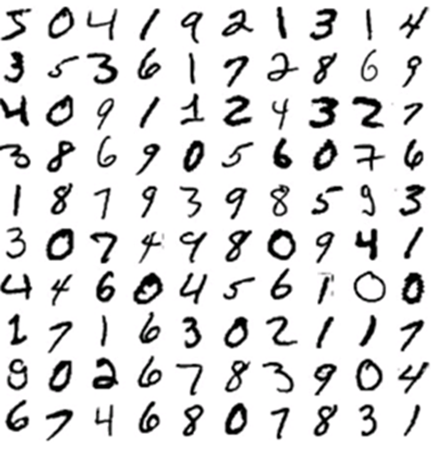
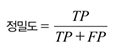
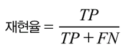
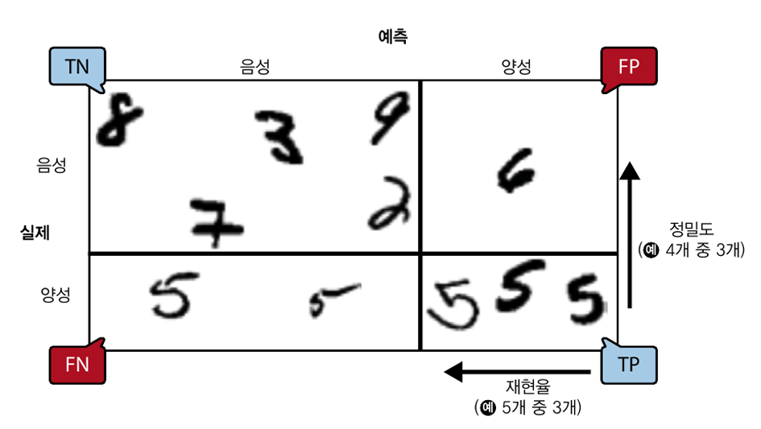
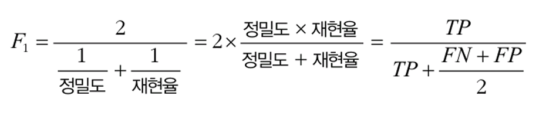
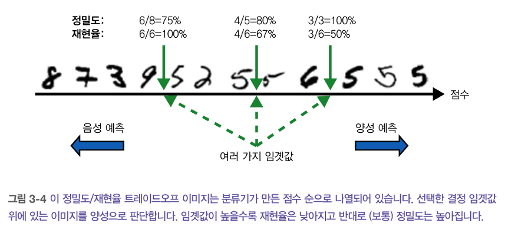
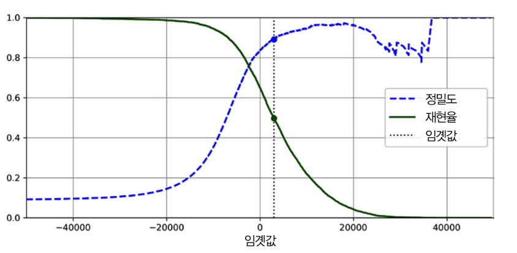
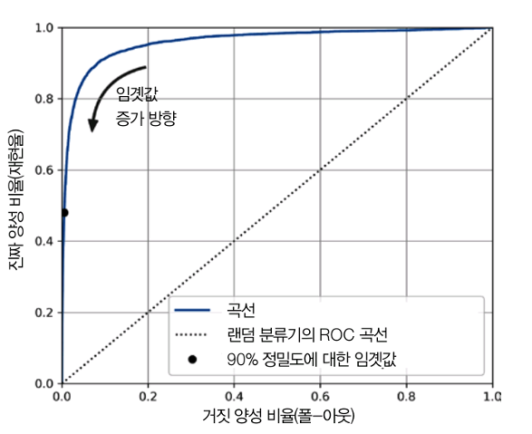
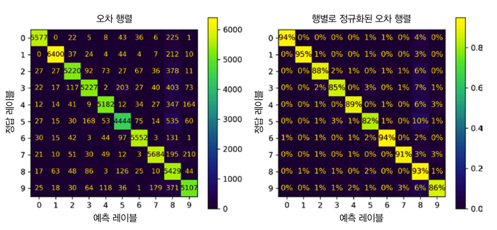
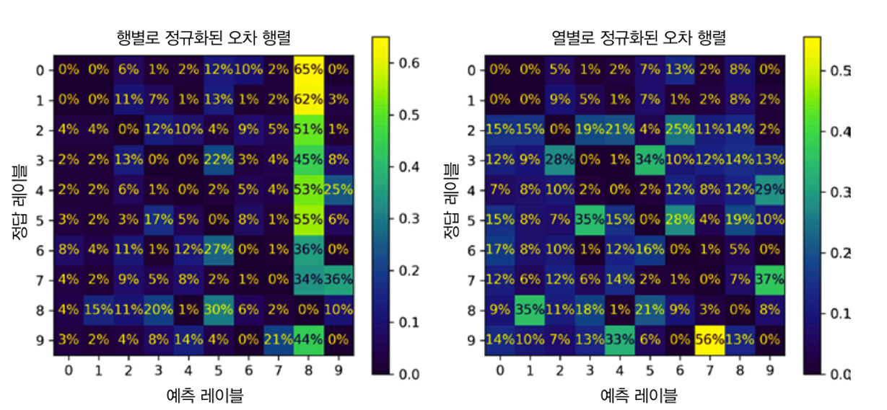

# 3장 분류

## 3.1-MNIST

**MNIST**란?: 고등학생과 미국 조사국 직원들이 손으로 쓴 70,000개의 작은 숫자 이미지. 학습용으로 매우 많이 사용하는 데이터셋으로 머신러닝계의 ‘Hello World’임.(28*28 픽셀수)



```python
#MNIST 데이터셋 내려받기
from sklearn.datasets import fetch_openml
mnist=fetch_openml('mnist_784',as_frame=False)

#MNIST 데이터 특성 출력
X,y=mnist.data,mnist.target
print(X)
print(X.shape) #(70000,784)
print(y)
print(y.shape) #(70000,)
```

## 3.2-이진 분류기 훈련

**이진 분류기**: 두 개의 클래스를 구분할 수 있음.

**'5-감지기'**: '5'와 '5 아님' 두가지 클래스를 구분 가능

**확률적 경사 하강법(SDG)**: 매우 큰 데이터셋을 효율적으로 처리 가능. 훈련 샘플을 독립적으로 처리 가능(온라인 학습에 적합)

**<5-감지기>**

```python
#훈련 세트,데이터 세트 나누기
X_train, X_test, y_train, y_test=X[:60000], X[60000:],y[:60000],y[60000:]

#1.타깃 벡터 만들기
y_train_5=(y_train=='5')
y_test_5=(y_test=='5')

#2.SDGClassifier 모델 만들고 훈련 세트를 이용해 훈련시키기
from sklearn.linear_model import SDGClassifier

sgd_clf=SDGClassifier(random_state=42)
sgd_clf.fit(X_train,y_train)

#3.모델을 사용해 숫자 5의 이미지 감지해보기
sdg_clf.predict([some_digit])
```

## 3.3 성능 측정

### 3.3.1 교차 검증을 사용한 정확도 측정

- **교차 검증:** 전체 데이터를 여러 조각으로 나눠서, 번갈아가면서 학습용/검증용으로 써보는 방식
   
- **정확도:** 정확한 예측의 비율. 이는 일반적으로 분류기의 성능 측정 지표로 선호되지는 않음(**특히 불균형한 데이터셋**의 경우)

### 3.3.2 오차 행렬

- **오차 행렬의 기본 아이디어:** 모든 A/B 쌍에 대해 클래스 A의 샘플이 클래스 B로 분류된 횟수를 세는 것.

<'5-분류기'의 경우>

|'5 아님'을 '5 아님'으로 분류(진짜음성)|'5 아님'을 '5'로 분류(거짓양성,1종오류)|
|--|--|
|**'5'를 '5아님'으로 분류(거짓음성,2종오류)**|**'5'를 '5'로 분류(진짜양성)**|

<**정밀도**>



❗TP는 진짜 양성의 수, FP는 거짓 양성의 수

<**재현율**>



❗FN은 거짓 음성의 수

❗정밀도와 재현율은 분류기의 성능 측정 지표로서 함께 사용됨.

<오차 행렬 그림>



### 3.3.3 정밀도와 재현율

- 정밀도와 재현율을 **$F_1$ 점수**라고 하는 하나의 숫자로 만들면 편리함. 이는 정밀도와 재현율의 **조화 평균**임.
  
<$F_1$ 점수>




<$F_1$ 점수 계산>
```python
from sklearn.metrics import f1_score
print(f1_score(y_train_5, y_train_pred))
#출력값: 0.7325171197343846
```


### 3.3.4 정밀도/재현율 트레이드오프

- **정밀도/재현율 트레이드오프:** 정밀도를 올리면 재현율이 줄고 그 반대도 같은 결과가 나타나는 현상.

- SGDClassifier는 **결정 함수**를 사용하여 각 샘플의 점수를 계산함. 점수가 임계값 이상이면 양성 클래스, 아니면 음성 클래스로 분류.

<정밀도/재현율 트레이드오프 이미지>



<결정 임계값에 대한 정밀도와 재현율>



### 3.3.5 ROC 곡선

- **수신기 조작 특성(ROC) 곡선**도 이진 분류에 널리 사용됨. 정밀도/재형율 곡선과 매우 비슷하나 ROC 곡선은 **거짓 양성 비율(FPR)**에 대한 **진짜 양성 비율(TPR)**의 곡선이다.

- ROC 곡선을 **민감도에 대한 1-특이도 비율**이라고도 함.

<ROC 곡선>

```python
from sklearn.metrics import roc_curve  # ROC 커브를 계산하는 함수 불러오기

# roc_curve 함수는 실제 타깃(y_train_5)과 점수값(y_scores)을 받아
# FPR(False Positive Rate), TPR(True Positive Rate), 임계값(thresholds)을 반환
fpr, tpr, thresholds = roc_curve(y_train_5, y_scores)

# 정밀도가 90%가 되는 시점의 임계값을 찾기 위한 인덱스 계산
# threshold_for_90_precision보다 작거나 같은 임계값 중 가장 큰 인덱스를 반환
idx_for_threshold_at_90 = (thresholds <= threshold_for_90_precision).argmax()

# 위에서 구한 인덱스를 기준으로 TPR, FPR 값 추출
tpr_90 = tpr[idx_for_threshold_at_90]
fpr_90 = fpr[idx_for_threshold_at_90]

# ROC 곡선 그리기 (TPR vs FPR)
plt.plot(fpr, tpr, linewidth=2, label="ROC 곡선")

# 무작위 추측의 ROC 커브는 대각선(0,0)~(1,1) 이므로 참조선으로 그려줌
plt.plot([0, 1], [0, 1], 'k:', label="랜덤 분류기의 ROC 곡선")

# 정확도 90%가 되는 지점을 표시 (검은색 원)
plt.plot([fpr_90], [tpr_90], "ko", label="90% 정밀도에 대한 임계값")

# 이후 라벨, 축, 범례, 그리드, 화살표 등 추가할 수 있음
plt.show()  # 그래프 출력
```



❗**곡선 아래의 면적(AUC)**을 측정하면 분류기를 비교할 수 있음. 완벽한 분류기는 AUC가 1이고, 완전한 랜덤 분류기는 0.5이다.


## 3.4 다중 분류

- **다중 분류기**는 이진 분류기와 다르게 둘 이상의 클래스를 구별할 수 있다.

  1. **OvR 또는 OvA :** 특정 이진 분류기 여러 개를 훈련시켜 모든 클래스를 분류할 수 있는 시스템 만들기
  2. **OvO:** 각 숫자 조합마다 이진 분류기를 훈련시키기. 매우 많은 이진 분류기가 필요하지만 각 분류기의 훈련에 필요한 샘플 수가 적다는 큰 장점이 있음. 
 
## 3.5 오류 분석

- 모델의 성능을 향상시키는 방법 중 하나는 생성된 **오류의 종류**를 분석하는 것임.

- 클래스 수가 많아져 오차 행렬에 포함되는 숫자가 많아지면 읽기 어려워짐 -> 컬러 그래프로 나타내면 읽기 쉬워짐

<오차 행렬을 컬러 그래프로 나타내기>

```python
from sklearn.metrics import ConfusionMatrixDisplay  # 혼동 행렬 시각화 도구 불러오기

# cross_val_predict는 교차 검증을 수행하면서 각 폴드의 예측 결과를 수집함
# → 훈련 세트 전체에 대해 예측값을 생성함 (마치 테스트 데이터처럼)
y_train_pred = cross_val_predict(sgd_clf, X_train_scaled, y_train, cv=3)

# 실제 정답(y_train)과 예측 결과(y_train_pred)를 비교하여 혼동 행렬을 시각화
ConfusionMatrixDisplay.from_predictions(y_train, y_train_pred)  
plt.show()  # 위에서 생성한 혼동 행렬 시각화 출력

# normalize="true" 옵션을 사용하면 각 행(클래스 기준)을 100% 기준으로 정규화함
# values_format=".0%"는 셀 안의 값을 퍼센트(%)로 소수점 없이 표현하게 해줌
ConfusionMatrixDisplay.from_predictions(
    y_train, y_train_pred, normalize="true", values_format=".0%"
)  
plt.show()  # 정규화된 혼동 행렬을 출력 (비율 기반 시각화)
```


❗5 이미지 82%만이 올바르게 분류되었고 5 이미지의 10%나 8로 잘못 분류되었음.

❗많은 숫자가 8로 잘못 분류 되었지만 그래프 상에서 눈에 띄지 않음. 이때 가중치를 0으로 설정해서 오류를 더 눈에 띄게 만드는 것도 가능함.

<가중치 0으로 설정하기>
```python
# 예측이 틀린 샘플에는 1, 맞춘 샘플에는 0의 가중치를 부여
# → 틀린 샘플만 강조해서 시각화할 수 있음
sample_weight = (y_train_pred != y_train)

# 정답값과 예측값을 기반으로 혼동 행렬 생성
# sample_weight에 따라 틀린 샘플들만 강조함 (틀린 것만 카운팅됨)
# normalize="true" → 각 행(정답 클래스) 기준으로 100% 정규화
# values_format=".0%" → 값은 퍼센트로 소수점 없이 출력
ConfusionMatrixDisplay.from_predictions(
    y_train, y_train_pred,
    sample_weight=sample_weight,
    normalize="true",
    values_format=".0%"
)

# 시각화된 오차 행렬 표시
plt.show()
```



- 추가로 분류기는 이미지의 위치, 회전 방향에 매우 민감함. 이럴 경우 훈련 이미지를 약간 이동시키거나 회전된 변형 이미지로 훈련 집합을 보강하는 **데이터 증식** 방버블 사용하면 오류를 줄일 수 있음.
## 3.6 다중 레이블 분류

- **다중 레이블 분류:** 여러 개의 이진 꼬리표를 출력하는 분류 시스템. 분류기가 샘플마다 여러 개의 클래스를 출력해야 할 때 사용함.

- 각 레이블의 가중치를 다르게 하고 싶다면 레이블에 클래스의 **지지도(타깃 레이블에 속한 샘플 수)** 를 가중치로 줄 수 있음

- SVC와 같이 다중 레이블 분류를 지원하지 않는 분류기를 사용하는 경우 레이블당 하나의 모델을 학습시키는 전략을 사용할 수 있음. 단, 이 전략은 레이블 간의 의존성 포착이 어려움.

## 3.7 다중 출력 분류

- **다중 출력 다중 클래스 분류(=다중 출력 분류):** 다중 레이블 분류에서 한 레이블이 다중 클래스가 될 수 있도록 일반화한 것.