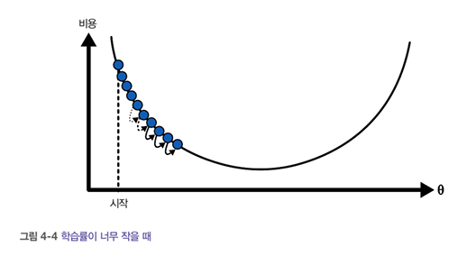
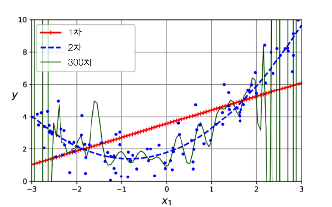

# 4장 모델 훈련

- 머신러닝의 내부 작동 방식을 몰라도 많은 일을 처리 가능.

- 그러나 구현의 세부 사항을 알면 적절한 모델, 올바른 훈련 알고리즘, 작업에 맞는 좋은 하이퍼파라미터를 빠르게 찾을 수 있음.

## 4.1 선형 회귀
**<간단한 선형 회귀 모델의 예>**
  
  

$\theta_0$, $\theta_1$이 모델 파라미터임.

  **<더 일반적인 선형 모델>**

  

  **<벡터 형태로 간단하게 쓰기>**

  

  ❗모델의 훈련이란 훈련 세트에 가장 잘 맞도록 파라미터를 설정하응 과정임.

  ❗비용 함수를 최소화하는 $\theta$를 찾아야 함.

### 4.1.1 정규 방정식

- **정규 방정식**: 비용 함수를 최소화하는 $\theta$ 값을 찾기 위한 수학 공식

  

  **<선형처럼 보이는 데이터 생성하기>**
```python
  
import numpy as np  # 넘파이 불러오기 (수치 계산용 라이브러리)

np.random.seed(42)  # 난수 생성 고정 (재현 가능하도록 시드 설정)

m = 100  # 데이터 포인트 100개 생성

# X: 0 ~ 2 사이의 실수 난수 100개 (100x1 형태의 입력 데이터)
X = 2 * np.random.rand(m, 1)

# y: 선형 관계 y = 4 + 3*X + 약간의 노이즈
# np.random.randn(m, 1) → 평균 0, 표준편차 1인 정규분포 노이즈 추가
y = 4 + 3 * X + np.random.randn(m, 1)
```
  

  **<정규 방정식을 사용해 $\hat{\theta}$ 계산하기>**

  ```python
  #<정규 방정식을 이용한 계산>
from sklearn.preprocessing import add_dummy_feature  # X 데이터에 bias용 1을 추가하는 함수

# X는 (m, 1) 형태의 입력 벡터인데, 거기에 dummy feature 1을 추가하여 (m, 2) 형태로 변환
# 즉, [1, x1], [1, x2], ... 이렇게 만들어서 bias term(세타0)을 포함시킴
X_b = add_dummy_feature(X)

# 정규방정식을 이용해서 θ (theta)를 직접 계산
# 수식: θ = (Xᵀ X)⁻¹ Xᵀ y
# np.linalg.inv : 역행렬
# @ : 행렬곱
theta_best = np.linalg.inv(X_b.T @ X_b) @ X_b.T @ y  # 최적의 세타 계산
print(theta_best) 
#출력값:array([[4.21509616],[2.77011339]])
  ```

  ❗inv()은 역행렬 계산, @은 행렬 곱셈

  ❗$\theta_0$=4, $\theta_1$=3을 기대했으나 값이 계산한 값이 약간 달랐음.

  ❗데이터셋이 적고 잡음이 많을수록 정확한 값을 얻기 힘듦

  **<계산한 세타를 이용한 예측>**
```python
X_new = np.array([[0], [2]])  # 예측하고 싶은 새로운 입력값 두 개 (0과 2)

# 새로운 입력값 X_new에도 더미 feature(맨 앞에 1)를 추가해야 θ와 곱할 수 있음
X_new_b = add_dummy_feature(X_new)  # → [[1. 0.], [1. 2.]] 형태가 됨

# 예측값 계산: y = Xθ
# θ는 이미 정규방정식으로 구해놨고, X_new_b와 곱해서 예측값 y를 구함
y_predict = X_new_b @ theta_best

print(y_predict)  
#출력값: array([[4.21509616],[9.75532293]])
```

### 4.1.2 계산 복잡도
- 정규 방정식은 (n+1)*(n+1) 크기의 역행렬 계산함.
- **계산 복잡도**: 특성 수가 n배 증가하면 계산 시간이 n^2.4 ~ n^3배 정도 늘어남.

## 4.2 경사 하강법

- **경사 하강법:** 비용 함수를 최소화하기 위해 반복해서 파라미터를 조정하는 최적화 알고리즘. 파라미터 벡터 $\theta$에 대해 비용 함수의 현재 gradient를 계산하여 gradient가 감소하는 방향으로 진행함.

  


- **학습률:** 파라미터의 스텝의 크기.
- **하이퍼파라미터:** 학습을 통해 조정되지 않고 사람이 사전에 결정해주는 파라미터(학습률도 그 예이다.)

  <학습률이 매우 작은 경우>
  
  
  ❗학습률이 너무 작으면 시간이 오래걸림.

  <학습률이 매우 큰 경우>
  
  
  ❗학습률이 너무 크면 오히려 더 높은 곳으로 올라가버림.

  <전역 최솟값과 지역 최솟값>
  

  ❗비용 함수의 모양이 울퉁불퉁하다면 **전역 최솟값**보다 더 높은 **지역 최솟값**으로 수렴할 가능성도 있음.

  <파라미터의 특성이 다른 경우>
  

  ❗특성1,2의 스케일이 같지 않다면 오른쪽 그림 같이 길쭉한 타원 모양의 비용 함수에서 최솟값을 찾느라 시간이 오래 걸릴 수도 있음.

### 4.2.1 배치 경사 하강법
- 경사 하강법 구현을 위해선 모델 파라미터 $\theta_j$에 대해 비용 함수의 gradient를 계산해야함. 이를 **편도함수**라고 함.

- **gradient 벡터**는 비용 함수의 편도함수(모델 파라미터 당 한 개씩임)를 모두 담고 있음.

- 위로 향하는 gradient 벡터가 구해지면 반대 방향인 아래로 진행해야함. 이때 gradient 벡터에 학습률을 곱한만큼을 $\theta$에서 뺌.

<배치 경사 하강법 알고리즘 구현>
```python
eta = 0.1             # 학습률(learning rate): 한 번의 업데이트에서 얼마나 움직일지 결정
n_epochs = 1000       # 반복 횟수(epoch): 데이터셋을 몇 번 반복할지
m = len(X_b)          # 데이터 개수 (샘플 수)

np.random.seed(42)    # 랜덤 초기화를 항상 똑같이 하기 위해 시드 고정
theta = np.random.randn(2, 1)  
# 파라미터 θ를 (2,1) 형식으로 무작위 초기화
# 여기서 2인 이유는: [편향용 dummy term 1, 특성 X] → 총 2개의 파라미터

for epoch in range(n_epochs):
    gradients = 2/m * X_b.T @ (X_b @ theta - y)  
    # 비용 함수(평균 제곱 오차)를 θ로 편미분한 값 (=그래디언트)
    # X_b.T: 특성 행렬의 전치, X_b@theta - y: 예측값 - 실제값 (오차)
    
    theta = theta - eta * gradients  
    # 현재 θ에서 그래디언트 방향으로 eta만큼 이동 (업데이트)

    print(theta) 
    #출력값: arrat([[4.21509619],[2.77011339]])
  ```

  ❗훈련 세트를 한 번 반복하는 것을 **에포크**라고 함.

  ❗정규 방정식을 이용했을 때와 동일함. 이는 경사 하강법이 완벽히 작동했음을 의미함.

  <여러 가지 학습률에 대한 경사 하강법>
  


### 4.2.2 확률적 경사 하강법

- 배치 경사 하강법은 매 스텝에서 전체 훈련 세트를 사용해 gradient를 계산해야한다는 문제점이 있음.

- **확률적 경사 하강법**은 매 스텝에서 한 개의 샘플을 랜덤으로 선택하고 그 하나의 샘플에 대한 gradient를 계산함. 매우 빠름. 그러나 더 **불안정**함.

- 이 단점을 극복하는 방법으로 학습률을 점진적으로 감소시키는 방법을 사용함. 매 반복에서 학습률을 결정하는 함수를 **학습 스케줄**이라고 함.

<간단한 학습 스케줄을 사용한 확률적 경사 하강법의 구현>
```python
n_epochs = 50                      # 전체 데이터를 50번 반복 학습 (에폭 수)
t0, t1 = 5, 50                     # 학습률 스케줄을 위한 하이퍼파라미터 (점점 학습률 감소)

def learning_schedule(t):         # 학습률 계산 함수 (점점 작아짐)
    return t0 / (t + t1)          # 반복 횟수 t가 커질수록 eta 작아짐

np.random.seed(42)                # 랜덤 시드 고정 (결과 재현 가능하게)
theta = np.random.randn(2, 1)     # θ 초기화 (편향 포함 총 2개 파라미터)

for epoch in range(n_epochs):                 # 전체 에폭 반복
    for iteration in range(m):               # 각 에폭에서 m번 반복 (데이터 개수만큼)
        random_index = np.random.randint(m)  # 무작위로 샘플 하나 선택
        xi = X_b[random_index:random_index+1]  # 선택한 샘플의 X값 (dummy feature 포함)
        yi = y[random_index:random_index+1]    # 선택한 샘플의 y값 (정답)

        gradients = 2 * xi.T @ (xi @ theta - yi)  # 샘플 하나에 대한 그래디언트 계산
        eta = learning_schedule(epoch * m + iteration)  # 현재 반복 횟수 기준으로 학습률 계산
        theta = theta - eta * gradients  # 파라미터 업데이트
        print(theta) 
```


### 4.2.3 미니 배치 경사 하강법
- **미니 배치 경사 하강법:** 전체 훈련 세트(배치 경사 하강법)나 하나의 샘플(확률적 경사 하강법)이 아닌 **미니배치**라고 부르는 작은 샘플 세트에 대해 gradient를 계산한다. 
- 확률적 경사 하강법과 달리 행렬 연산에 특화된 하드웨어(GPU 등)를 통해 성능을 강화할 수 있음.

  <배치,확률적,미니배치 경사 하강법의 경로>
  

  |      |배치   |확률적 |미니배치|
  |------|------|------|------|
  |소요시간|큼    |작음  |미니배치 크기에 따라 다름|
  |불규칙성|작음  |큼    |중간|


## 4.3 다항회귀

- **다항회귀:** 비선형 데이터를 선형 모델을 이용해 학습하는 방법이다. 각 특성의 거듭제곱을 새로운 특성에 추가하고, 이 확장된 데이터셋에 선형 모델을 훈련시키는 것이다.

<비선형 데이터 생성하기>
```python
import numpy as np  # 넘파이 불러오기

np.random.seed(42)  # 랜덤 시드 고정 (재현 가능성 위해)

m = 100  # 데이터 샘플 수 = 100개

X = 6 * np.random.rand(m, 1) - 3  
# -3 ~ +3 사이의 실수값 생성 (6배 확대 후 3 빼기)
# => 입력값 X는 [-3, 3] 범위의 값들

y = 0.5 * X**2 + X + 2 + np.random.randn(m, 1)
# y = 0.5 * X^2 + X + 2 에 약간의 노이즈 추가한 것
# 즉, 정답값 y는 2차 함수 기반의 값 + 잡음
```

<생성된 데이터의 특성 X의 제곱을 포함하는 확장된 데이터 생성하기>
```python
from sklearn.preprocessing import PolynomialFeatures  # 다항 특징 생성기 임포트

poly_features = PolynomialFeatures(degree=2, include_bias=False)  
# degree=2 → 최고차항이 2인 다항식 특징 생성 (예: x, x^2)
# include_bias=False → 절편항(1)은 제외하고 생성

X_poly = poly_features.fit_transform(X)  
# 원래 X 데이터를 x → [x, x^2] 형태로 확장시킴

X[0]  
# 원래 X의 첫 번째 샘플: 예를 들어 x₀ = -0.75

X_poly[0]  
# 확장된 X의 첫 번째 샘플: [-0.75, 0.5666] = [-0.75, (-0.75)^2]
# 즉, 원래 값과 제곱값을 나란히 추가한 형태
```

<확장된 데이터로 선형 모델 학습하기>
```python
from sklearn.linear_model import LinearRegression
lin_reg = LinearRegression()  # 선형 회귀 모델 객체 생성

lin_reg.fit(X_poly, y)  
# X_poly: 다항 특징을 포함한 입력 데이터 (예: [x, x^2])
# y: 타겟값
# → 선형 회귀 모델을 X_poly와 y에 맞게 학습시킴

print(lin_reg.intercept_, lin_reg.coef_)
# 학습된 모델의 절편(세타0)과 계수들(세타1, 세타2, ...)
# 결과:
# intercept_ → 세타0 ≈ 1.781
# coef_ → 세타1 ≈ 0.934, 세타2 ≈ 0.565
```


## 4.4 학습 곡선

  

  ❗1차는 **과소적합**, 300차는 **과대적합**

  어떤 함수로 생성되었는지 모르는 데이터에 최적인 모델을 어떻게 찾을 수 있을까?

   - 방법1. **교차 검증**
   
   - 방법2. **학습 곡선:** 훈련 오차와 검증 오차를 훈련 반복 횟수의 함수로 나타낸 그래프. 훈련하는 동안 일정한 간격으로 모델을 평가하고 그 결과를 그래프로 나타내면 됨.

     - 사이킷런의 learning_curve() 함수를 사용하면 교차 검증을 사용하여 모델을 훈련하고 평가할 수 있음.
  
<learning_curve()을 이용하여 학습 곡선 살펴보기>
```python
from sklearn.model_selection import learning_curve  # 학습 곡선(훈련/검증 오차 추이) 그리기 위한 함수 임포트

train_sizes, train_scores, valid_scores = learning_curve(
    LinearRegression(),                      # 사용할 모델: 선형 회귀
    X, y,                                    # 입력 데이터 X와 타깃 y
    train_sizes=np.linspace(0.01, 1.0, 40),  # 훈련 데이터 크기를 1%부터 100%까지 40개 지점으로 나눔
    cv=5,                                    # 교차 검증 폴드 수: 5폴드
    scoring="neg_root_mean_squared_error"   # RMSE의 음수 값을 점수로 사용 (사이킷런은 점수가 클수록 좋다고 가정하기 때문)
)

train_errors = -train_scores.mean(axis=1)  # 훈련 세트에서 얻은 점수 평균을 음수로 뒤집어 실제 RMSE로 변환
valid_errors = -valid_scores.mean(axis=1)  # 검증 세트 점수도 평균 내고 음수 처리하여 실제 RMSE로 변환

plt.plot(train_sizes, train_errors, "r-+", linewidth=2, label="훈련 세트")  # 훈련 에러를 빨간 선+점으로 그림
plt.plot(train_sizes, valid_errors, "b-", linewidth=3, label="검증 세트")   # 검증 에러를 파란 실선으로 그림
[...] # 레이블, 축, 그리드, 범례를 추가합니다.
plt.show()  # 그래프 출력
```

  ❗이 그래프는 **과소적합 모델**의 전형적인 모습이다.(훈련 곡선과 검증 곡선이 꽤 높은 오차 수준에서 매우 가까이 근접해 있는 형태)

<같은 데이터에서 10차 다항 회귀 모델의 학습 곡선 그려보기>
```python
from sklearn.pipeline import make_pipeline  
# 여러 전처리 + 모델을 순차적으로 처리하는 pipeline 생성 함수

polynomial_regression = make_pipeline(
    PolynomialFeatures(degree=10, include_bias=False),  # 입력 X를 다항 특성으로 확장 (x, x², ..., x¹⁰)
    LinearRegression())  # 다항 회귀지만 결국은 선형 모델을 학습함

# → 결과적으로 "10차 다항 회귀 모델"이 됨.
train_sizes, train_scores, valid_scores = learning_curve(
    polynomial_regression,   # 평가할 모델: 10차 다항 회귀
    X, y,                    # 입력 데이터 X와 타겟 y
    train_sizes=np.linspace(0.01, 1.0, 40),  
    # 훈련 데이터 크기를 1% ~ 100%까지 40개로 나눠서 학습 곡선 측정
    cv=5,                   
    # 5-Fold 교차검증으로 train/valid 점수 측정
    scoring="neg_root_mean_squared_error"
    # RMSE(root mean squared error)의 음수로 점수를 줌 (사이킷런은 높은 점수를 좋게 보니까 부호 뒤집음)
)
# → 학습 곡선: 훈련 데이터 수에 따라 train score, valid score가 어떻게 변하는지 측정

#[...] 이전과 동일
```


❗이 그래프는 전형적인 **과대적합 모델**의 특징을 보인다.(훈련 세트에서 오차가 훨씬 적음)

## 4.5 규제가 있는 선형 모델
- 과대적합을 줄이는 좋은 방법은 모델을 규제하는 것임. 다항 회귀 모델에서는 다항식의 차수를 줄여 간단히 이를 구현할 수 있음.

### 4.5.1 릿지 회귀

- **릿지 회귀(티호노프 규제):** 규제가 추가된 선형 회귀 

<MSE에 추가되는 규제항>


❗규제항은 훈련동안에만 비용 함수에 추가되며 훈련이 끝나면 규제가 없는 MSE(또는 RMSE)로 평가함.

❗하이퍼파라미터 α는 모델을 얼마나 규제할지 조절

❗편향 $\theta_0$는 규제되지 않음.

<사이킷런에서 정규 방정식을 사용한 릿지 회귀 적용>
```python
from sklearn.linear_model import Ridge  # Ridge(릿지) 회귀 모델 불러오기

ridge_reg = Ridge(alpha=0.1, solver="cholesky")  
# Ridge 회귀 모델 객체 생성
# alpha=0.1 → 정규화 강도(λ): 높을수록 규제가 강해짐
# solver="cholesky" → 선형 방정식을 푸는 방식으로 Cholesky 분해를 사용

ridge_reg.fit(X, y)  
# 학습 데이터 X, y를 사용해서 모델 학습

print(ridge_reg.predict([[1.5]]))  
# 새로운 입력값 x = 1.5에 대한 예측값 계산
# 출력값: array([[1.55325833]]) → 예측 결과는 약 1.553
```
<사이킷런에서 확률적 경사 하강법을 사용한 릿지 회귀 적용>
```python
from sklearn.linear_model import SGDRegressor  # 확률적 경사 하강법 회귀 모델 불러오기

sgd_reg = SGDRegressor(
    penalty="l2",             # 규제 방식: L2 (릿지 회귀와 같은 효과)
    alpha=0.1 / m,            # 정규화 강도 (λ), 여기선 샘플 수 m에 따라 조정된 값 사용
    tol=None,                 # 수렴 조건 비활성화 (정해진 반복 횟수만큼 무조건 반복)
    max_iter=1000,            # 최대 반복 횟수: 1000 에폭까지 학습 가능
    eta0=0.01,                # 초기 학습률 (learning rate)
    random_state=42           # 결과 재현을 위한 랜덤 시드 설정
)

sgd_reg.fit(X, y.ravel())  
# 모델 학습: fit()은 1차원 타깃 벡터를 요구하므로 y.ravel()로 (m,1) → (m,) 형태로 변형해서 사용

sgd_reg.predict([[1.5]])  
# 입력값 x = 1.5에 대해 예측값 계산
# 출력 결과: array([1.55302613]) → 예측값은 약 1.553
```

### 4.5.2 라쏘 회귀

- **라쏘 회귀:**선형 회귀의 또 다른 규제된 버전.

<라쏘 회귀의 규제항>


❗라쏘의 비용 함수는 $\theta_i$=0($i$=1,2,...,$n$일 때)에서 미분 가능하지 않음. 

❗이때 **서브그레이디언트 벡터 g**를 사용하면 경사 하강법 사용 가능.

<서브그레이디언트 벡터>


<Lasso 클래스를 사용한 간단한 사이킷런 예제>
```python
from sklearn.linear_model import Lasso  # Lasso 회귀(선형 회귀 + L1 정규화) 모델 임포트

lasso_reg = Lasso(alpha=0.1)  
# Lasso 모델 생성, alpha=0.1 → 정규화 강도 설정 (L1 패널티 항의 가중치)

lasso_reg.fit(X, y)  
# 훈련 데이터 X와 타깃 y를 기반으로 모델 학습 수행

lasso_reg.predict([[1.5]])  
# 새로운 입력값 x = 1.5에 대해 예측값 계산
# 출력 결과: array([1.53788174]) → 예측된 y값은 약 1.538
```

### 4.5.3 엘라스틱넷

- **엘라스틱넷 회귀:**릿지 회귀와 라쏘 회귀를 절충한 모델. 

- 규제항은 릿지와 라쏘의 규제항을 더한 것이며 혼합 정도는 **혼합 비율 r**을 사용해 조절함. 

- r=0이면 엘라스틱넷 회귀는 릿지 회귀와 같고 r=1이면 라쏘 회귀와 같음.

<엘라스틱넷 규제항>


<사이킷런의 ElasticNet을 사용한 간단한 예제>
```python
from sklearn.linear_model import ElasticNet  # ElasticNet 모델 import (L1 + L2 정규화 결합 모델)

elastic_net = ElasticNet(alpha=0.1, l1_ratio=0.5)  
# alpha: 정규화 강도 (클수록 규제가 더 강해짐)
# l1_ratio=0.5: L1과 L2 정규화의 혼합 비율 (0은 Ridge, 1은 Lasso, 0.5면 둘 반반)

elastic_net.fit(X, y)  
# 훈련 데이터 X와 타깃 y로 모델 학습

elastic_net.predict([[1.5]])  
# 입력값 x=1.5일 때 예측값 출력
# 결과: array([1.54333232]) → 예측된 y값은 약 1.543
```

### 4.5.4 조기 종료

- **조기 종료:** 검증 오차가 최솟값에 도달하면 바로 훈련을 중지시키는 학습 알고리즘 규제법.

<조기 종료 규제>


## 4.6 로지스틱 회귀

- **로지스틱 회귀:** 샘플이 특정 클래스에 속할 확률을 추정하는데 사용되는 회귀 알고리즘.

### 4.6.1 확률 추정

- 입력 특성의 가중치 합을 계산하여 편향을 더한 후 바로 결과를 출력하지 않고 겨뢋값의 **로지스틱**을 출력한다.

<로지스틱 회귀 모델의 확률 추정 벡터 표현식>


- **로지스틱:** 0과 1 사이의 값을 출력하는 **시그모이드 함수**

<로지스틱 함수>


❗50% 보다 크다면 양성 클래스(1), 작다면 음성 클래스(0)로 분류

### 4.6.4 소프트매스 회귀

- **소프트맥스 회귀(다항 로지스틱 회귀):** 로지스틱 회귀 모델을 여러 개의 이진 분류기를 훈련시켜 연결하지 않고 다중 클래스를 지원하도록 일반화 한 것.

- 샘플 x가 주어지면 소프트맥스 회귀 모델이 각 클래스 $k$에 대한 점수 $s_k$(x)를 계산하고, 그 점수에 **소프트맥스 함수(정규화된 지수 함수)**를 적용하여 각 클래스의 확률을 추정함.

<클래스 $k$에 대한 소프트맥스 점수>


<소프트맥스 함수>


❗로지스틱과 마찬가지로 소프트맥스 회귀도 추정 확률이 가장 높은(점수가 가장 높은) 클래스를 선택함.

❗**크로스 엔트로피 비용 함수**가 최소화되면 타깃 클래스에 대해 낮은 확률을 예측하는 모델을 억제할 수 있기 때문에 이 함수가 소프트맥스 회귀 훈련 방식에 많이 사용됨.

<크로스 엔트로피 비용 함수>


<클래스 $k$에 대한 크로스 엔트로피의 gradient 벡터>


❗각 클래스에 대한 gradient 벡터를 계산할 수 있으므로 비용 함수를 최소화하기 위한 파라미터 행렬을 찾기 위해 경사 하강법 등을 사용할 수 있다.