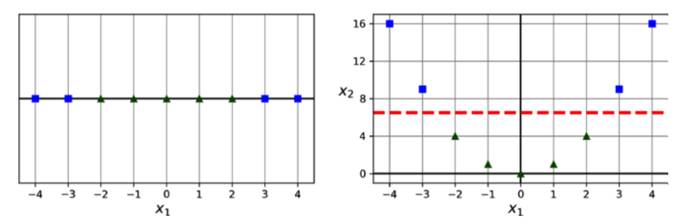

# 5 서포트 벡터 머신

- **서포터 벡터 머신(SVM)**은 매우 강력한 다목적 머신러닝 모델임. 중규모의 비선형 데이터셋(특히 분류 작업 시)에 매우 적합. 그러나 대규모 데이터에는 부적합.

## 5.1 선형 SVM 분류

<적절하지 못한 선형 모델>


❗점선은 데이터를 잘 분류하지 못하고 있으며 나머지 두 실선도 훈련 데이터와의 거리가 너무 가까워 새로운 데이터에 대해 잘 작동하지 못할 가능성이 큼.

<SVM 분류기가 찾은 결정 경계>

 

❗데이터를 적절하게 분류할뿐 아니라 적절한 거리에 떨어져 있음

❗클래스 사이에 가장 넓은 도로(점선으로 구분된 구역)를 찾는다고 생각할 수 있으며 이 때문에 **라지 마진 분류**라고도 불림.

❗도로 바깥에 데이터를 추가해도 결정 경계는 변하지 않으며 도로 경계에 위치한 샘플인 **서포트 벡터(회색 동그라미로 표시)**에 의해 결정 경계가 결정됨.

<특성 스케일에 따른 민감성>


❗SVM은 특성 스케일에 매우 민감.

### 5.1.1 소프트 마진 분류

- **하드 마진 분류:** 모든 샘플이 도로 바깥쪽에 올바르게 분류되어 있는 경우.
  - 하드 마진 분류의 문제점

     1. 데이터가 선형적으로 구분될 수 있어야 제대로 작동한다.
     2. 이상치에 매우 민감하다.

    <이상치에 민감한 하드 마진>

    

    ❗이렇게 도로 중간, 심지어 반대편에 있는 샘플을 **마진오류**라고 함.

- **소프트 마진 분류:** 도로 폭을 가능한 넓게 유지하는 것과 마진 오류 사이에 적절한 균형을 잡아주는 것.

  <규제 하이퍼파라미터 C에 따른 마진 넓이>

  

  ❗규제 하이퍼파라미터 C가 클수록 마진이 좁아짐.

  <C=1인 LinearSVC를 사용해 SCM 모델 훈련시키기>

  ```python
  # 사이킷런에서 필요한 모듈들 불러오기
  from sklearn.datasets import load_iris                 # 아이리스 데이터셋 로드용
  from sklearn.pipeline import make_pipeline             # 파이프라인 생성 함수
  from sklearn.preprocessing import StandardScaler       # 표준화(정규화) 도구
  from sklearn.svm import LinearSVC                      # 선형 서포트 벡터 머신 분류기

  # 아이리스 데이터셋 불러오기 (판다스 DataFrame 형식으로 불러옴)
  iris = load_iris(as_frame=True)

  # 입력 특성: 꽃잎 길이와 너비만 사용
  X = iris.data[["petal length (cm)", "petal width (cm)"]].values

  # 타겟값: Iris-Virginica이면 1, 아니면 0으로 이진 분류 만들기
  y = (iris.target == 2)  # Iris-Virginica에 해당하면 True → 1

  # 파이프라인 생성: (1) 입력값 정규화 → (2) SVM 학습
  svm_clf = make_pipeline(
    StandardScaler(),                     # 표준화: 평균 0, 분산 1로 스케일 조정
    LinearSVC(C=1, random_state=42)       # 선형 SVM 분류기 (C는 규제 강도)
  )

  # 모델 학습 실행
  svm_clf.fit(X, y)

  ```

## 5.2 비선형 SVM 분류

  <특성을 추가하여 선형으로 구분 가능한 데이터셋 만들기>

  

  <다항 특성을 사용한 선형 SVM 분류기>

  ```python
  # make_moons: 두 개의 반달 모양 데이터셋 생성
  # PolynomialFeatures: 다항 특성 추가 도구
  from sklearn.datasets import make_moons
  from sklearn.preprocessing import PolynomialFeatures

  # 반달 모양의 비선형 데이터셋 100개 생성 (노이즈 약간 추가)
  X, y = make_moons(n_samples=100, noise=0.15, random_state=42)

  # 파이프라인 구성: (1) 다항 특성 만들기 → (2) 정규화 → (3) SVM 훈련
  polynomial_svm_clf = make_pipeline(
      PolynomialFeatures(degree=3),          # 다항 특성 추가 (최고차항 3차까지)
      StandardScaler(),                      # 특성 스케일 정규화
      LinearSVC(C=10, max_iter=10_000, random_state=42)  # 선형 SVM 훈련 (규제 약하게)
  )

  # 전체 데이터셋으로 학습 수행
  polynomial_svm_clf.fit(X, y)
  ```

  

### 5.2.1 다항식 커널

-  다항식의 차수가 낮으면 복잡한 데이터셋을 잘 표현하지 못하고 너무 높으면 모델이 느려짐.
  
- 다행히 **커널 트릭**을 사용하면 실제로는 특성을 추가하지 않으면서 매우 높은 차수의 다항 특성을 많이 추가한 것과도 같은 결과를 얻게 해줌.

  <3차 다항식 커널을 사용해 SVM 분류기 훈련시키기>

  ```python
  # SVC: 커널 기반 서포트 벡터 머신 분류기
  from sklearn.svm import SVC

  # 파이프라인 구성: (1) 표준화 → (2) 다항 커널 SVM 학습
  poly_kernel_svm_clf = make_pipeline(
      StandardScaler(),                           # 특성 스케일 정규화
      SVC(kernel="poly", degree=3, coef0=1, C=5)  # 다항 커널 사용, 3차, coef0=1(모델이 높은 차수와 낮은 차수에 얼마나 영향을 받을지 조절), 규제강도 C=5
  )

  # 전체 데이터셋으로 모델 훈련
  poly_kernel_svm_clf.fit(X, y)
  ```

  

### 5.2.2 유사도 특성

- 비선형 특성을 다루는 또 다른 기법은 각 샘플이 특정 랜드마크와 얼마나 닮았는지를 측정하는 **유사도 함수**로 계산한 특성을 추가하는 것임.

### 5.3.2 가우스 RBF 커널

- **가우스 RBF**는 유사도 함수로 사용될 수 있음.

- 여기에도 **커널 트릭**을 사용하면 유사도 특성을 많이 추가하는 것과 비슷한 결과를 얻을 수 있음.

  <가우스 RBF 커널을 사용한 SVC 모델>

  ```python
  # RBF(가우시안) 커널을 사용하는 서포트 벡터 머신 분류기 생성
  rbf_kernel_svm_clf = make_pipeline(
    StandardScaler(),                  # 특성값을 평균 0, 표준편차 1로 정규화
    SVC(kernel="rbf", gamma=5, C=0.001)  # RBF 커널 사용, 감마는 곡률 조절, C는 규제 강도 (작을수록 규제 강함)
  )

  # 전체 데이터셋으로 모델 학습 수행
  rbf_kernel_svm_clf.fit(X, y)
  ```

  

### 5.2.4 계산 복잡도

<SVM 분류를 위한 사이킷런 파이썬 클래스 비교>


## 5.3 SVM 회귀

- 분류는 두 클래스 간에 마진이 최대한 커지도록 조정함. 반면 **회귀**에서는 마진 안에 가능한 많은 샘플이 들어가도록 조정함. 도로의 폭은 **하이퍼파라미터 $\varepsilon$** 으로 조절.

  <SVM 회귀>

  

  <LineaSVR을 사용해 선형 SVM 회귀 적용해보기>

  ```python
  from sklearn.svm import LinearSVR   # 선형 서포트 벡터 회귀(Linear Support Vector Regression) 클래스 임포트

  X, y = [...]   # 입력 특성 X와 타깃 y를 선형 회귀용 데이터로 설정 (생략된 부분은 실제 데이터로 대체해야 함)

  svm_reg = make_pipeline(           # 전처리와 모델을 하나의 파이프라인으로 구성
    StandardScaler(),                # 특성값 표준화 (평균 0, 표준편차 1)
    LinearSVR(epsilon=0.5,          # ε-튜브 내의 오차는 무시, 즉 ε=0.5보다 작은 오차는 비용 함수에 포함하지 않음
              random_state=42)      # 결과 재현성을 위한 시드 설정
  )

  svm_reg.fit(X, y)   # 파이프라인 학습: 표준화 후 선형 SVR 모델 학습
  ```
  

  <2차 다항 커널을 사용한 SVM 회귀>

  

## 5.4 SVM 이론

### 하드 마진
- 선형 SVM 분류기 모델은 단순히 결정 함수 **$\theta^T$x** = $\theta_0 x+...+\theta_n x_n$을 계산해서 새로운 샘플 x의 클래스를 예측함. 결과가 0보다 크면 양성, 작으면 음성.

- 훈련 과정에선 다음을 요구함
    
   1. 마진 오류 횟수 제한하기

   2. 마진을 가능한 넓게 만들기

- 이를 위해서 적절한 가중치 벡터 w와 편향 b를 찾아야 함.
  
   1. w가 작을수록 마진의 폭이 넓음.
    
   2. b는 마진의 폭에는 영향을 주지 않고 이동에만 관여.

- 마진 오류를 피하기 위해선 결정 함수가 모든 양성 훈련 샘플이 마진 밖에 있어야 함.

- 이와 같은 하드 마진 선형 SVM 분류기의 목적 함수는 **제약이 있는 최적화 문제**로 표현 가능

  <하드 마진 선형 SVM 분류기의 목적 함수>

  

  ❗모든 데이터를 완벽히 분리하면서, 가장 마진이 큰 결정 경계를 찾기.

### 소프트 마진

- 소프트 마진 분류기의 목적 함수는 각 샘플이 얼마나 마진을 위반할지를 결정하는 **슬랙 변수 $\zeta^{(i)}$** 를 고려해야 함.

  <소프트 마진 선형 SVM 분류기의 목적 함수>

  

- **콰드라틱 프로그래밍(QP) 문제**는 선형적인 제약 조건이 있는 볼록 함수의 이차 최적화 문제로 하드, 소프트 마진 문제가 모두 QP에 속함.

- SVM을 훈련하는 방법

   1. QP 솔버를 사용하기

   2. 경사 하강법을 사용하여 힌지 손실 또는 제곱 힌지 손실을 최소화하기

   3. **쌍대 문제**
   
   <힌지 손실과 제곱 힌지 손실>

   

   ❗마진의 경계를 1, -1로 정했다면 빨간줄인 음성 클래스의 힌지 손실은 -1 이하로 내려가면 0이 된다. 즉 모든 음성 클래스가 마진 밖에 분류 되었고 마진 오류가 없음을 의미한다. 양성 클래스(초록줄)에 경우도 같다.


## 5.5 쌍대 문제

- **원 문제**라고 하는 제약이 있는 최적화 문제가 주어지면 **쌍대 문제**라는 다른 문제로 표현이 가능함. 일반적으로 쌍대 문제의 해는 원 문제의 해의 하한값이지만 어떤 조건 하에서는 원 문제와 같은 해를 제공하며 SVM 문제는 이 조건을 만족함.

  <선형 SVM 목적 함수의 쌍대 형식>

  

  ❗이 식을 최소화하는 벡터 **$\hat{\alpha}$** 을 찾았다면 특정 식을 사용하여 원 문제의 식을 최소화하는 $\hat{w}$와 $\hat{b}$를 계산할 수 있음.

  <쌍대 문제에서 구한 해로 원 문제의 해 계산하기>

  

  ❗훈련 샘플 수가 특성 개수보다 작을 때 원 문제봐 쌍대 문제를 푸는 것이 더 빠름.

  ❗쌍대 문제는 원 문제와 달리 커널 트릭 사용이 가능함.


### 5.5.1 커널 SVM

- 비선형 결정 경계가 필요한 경우, 데이터를 고차원 특성 공간으로 매핑해서 선형 분리를 시도함.

- 이때 매핑 함수 $\Phi$를 직접 계산하지 않고 두 샘플 간 고차원 내적값만 계산할 수 있으며 이를 **커널 트릭**이라 함.

  <매핑 함수를 이용해 변환된 벡터의 점곱=원래 벡터의 점곱>

  

  ❗즉, 어렵게 샘플을 변환해서 SVM 알고리즘을 적용하나 그냥 샘플을 이용하나 결괏값이 같아지며 이는 계산량을 효율적으로 단축시킴.

  <일반적인 커널>

  

  ❗K(a,b)는 변환된 샘플 벡터의 점곱을 의미함.

- 이러한 커널 트릭의 특징을 사용하면 변환된 샘플 벡터의 차원이 매우 커서 w를 구할 수 없더라도 SVM 분류기를 사용해 예측을 수행할 수 있음.
