# 6 결정 트리

- **결정 트리**는 분류와 회귀 작업 그리고 다중 출력 작업까지 가능한 다목적 머신러닝 알고리즘임.

- 결정 트리는 최근에 자주 사용되는 강력한 머신러닝 알고리즘인 **랜덤 포래스트**의 기본 구성 요소이기도 함.

## 6.1 결정 트리 학습과 시각화

  <붓꽃 결정 트리>

  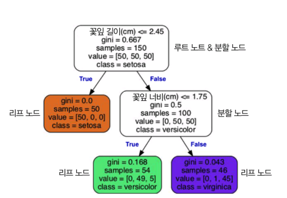

## 6.2 예측

- 위 결정 트리가 어떻게 예측을 만들어낼지 살펴보자.
  
    1. **루트 노드**가 꽃잎 길이가 2.45com보다 짧은지 검사한다.
    2. 만약 그렇다면 왼쪽 **리프 노드**로 이동하여 추가적인 검사 없이 데이터를 class=setosa로 분류하고 그렇지 않다면 오른쪽 분할 노드로 이동한다.
    3. 분할 노드는 꽃잎 너비가 1.75cm보다 작은지 검사한다.
    4. 만약 그렇다면 왼쪽 리프 노드로 이동하여 class=versicolor로 분류되고 그렇지 안다면 오른쪽 리프노드로 이동하여 classvirginica로 분류된다.

- 노드의 sample 속성은 얼마나 많은 훈련 샘플이 적용되었는지 헤아린 것임.

- 노드의 value 속성은 노드에서 각 클래스에 얼마나 많은 훈련 샘플이 있는지 알려줌. 

- 노드의 gini 속성은 **지니 불순도**를 측정함. 한 노드의 모든 샘플이 같은 클래스에 속해 있다면 순수한 노드(gini=0)임.

  <지니 불순도>

  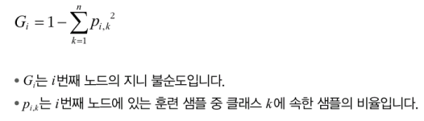

  <결정 트리의 결정 경계>

  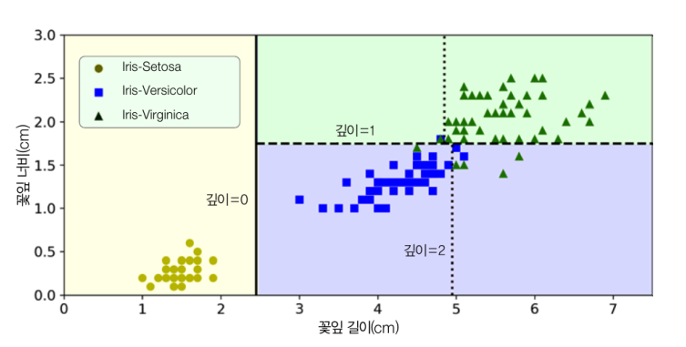

## 6.3 클래스 확률 추정

- 결정 트리는 한 샘플이 특정 클래스 $k$에 속할 확률을 추정할 수 있음.

- 예를 들어 class=versicolor로 분류하는 리프 노드에는 setosa class 0개, versicolor 49개, virginica 5개가 있으니 확률은 49/54=90.7%임.

## 6.4 CART 훈련 알고리즘

- 사이킷런은 결정 트리 훈련을 위해 **CART 알고리즘**을 사용함.

- CART 알고리즘은 다음과 같이 진행됨
  1. 훈련 세트를 하나의 특성 $k$와 임계값 $t_k$를 사용해 두개의 서브셋으로 나눔. 
  2. 이때 ($k$, $t_k$) 쌍을 찾는 알고리즘은 다음과 같은 비용 함수를 최소화함.

     <분류에 대한 CART 비용 함수>

     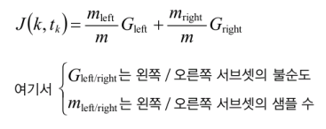

  3. 훈련 세트를 성공적으로 둘로 나누었다면 같은 방식으로 서브셋을 나누는 것을 반복함.
  4. 최대 깊이가 되거나 불순도를 줄이는 분할을 찾을 수 없을 때 멈춤.

## 6.6 지니 불순도 또는 엔트로피?

- 기본적으로 DecisionTreeClassifier 클래스는 지니 불순도를 사용하나 citerion 매개변수를 "entropy"로 지정하여 **엔트로피 불순도**를 사용할 수 있음.

- 분자의 무질서함을 측정하는 엔트로피 개념은 정보의 측면에서도 사용가능함.

- 모든 메세지가 동일할 때 엔트로피가 0이 됨.

  <엔트로피>

  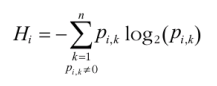

- 지니 불순도와 엔트로피는 큰 차이는 없으나 지니는 계산이 더 빠르며 엔트로피는 더 균형잡힌 트리를 만듦.

## 6.7 규제 매개변수

- 결정 트리는 훈련 데이터에 대한 제약 사항이 거의 없기에 과대 적합되기 쉬움.

- 결정 트리는 훈련 전에 파라미터 수가 결정되지 않는 **비파라미터 모델**이기 때문에 선형 모델과 같이 파라미터 수가 미리 정해진 **파라미터 모델**보다 과대 적합되기 쉬움.

- 때문에 결정 트리의 자유도를 제한할 필요가 있음. 이를 **규제**라고 함.

- 사이킷런에서는 max_depth 매개변수 사용. 이 값을 줄이면 규제가 강해지며 과대적합 위험이 줄어듦.

  <결정 트리의 형태를 제한하는 다른 하이퍼파라미터>

  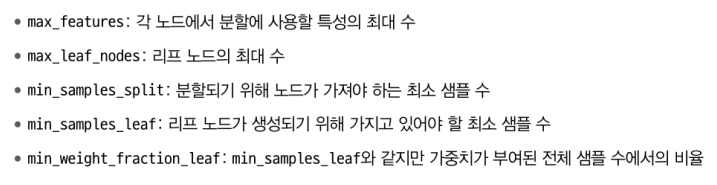

  <moons 데이터셋에서 규제 테스트해보기>

  ```python
  from sklearn.datasets import make_moons  # 반달 모양 이진 분류용 toy 데이터셋 생성 함수 임포트

  # 150개의 샘플을 생성하며, noise를 0.2로 줘서 약간 섞이도록 함 (랜덤 고정)
  X_moons, y_moons = make_moons(n_samples=150, noise=0.2, random_state=42)

  # 기본 설정의 결정 트리 모델 (깊이 제한 없음, 과적합 위험 높음)
  tree_clf1 = DecisionTreeClassifier(random_state=42)

  # 리프 노드에 최소 5개 이상의 샘플이 있도록 제한해 과적합 완화
  tree_clf2 = DecisionTreeClassifier(min_samples_leaf=5, random_state=42)

  # 데이터에 대해 두 모델 각각 훈련
  tree_clf1.fit(X_moons, y_moons)
  tree_clf2.fit(X_moons, y_moons)
  ```

  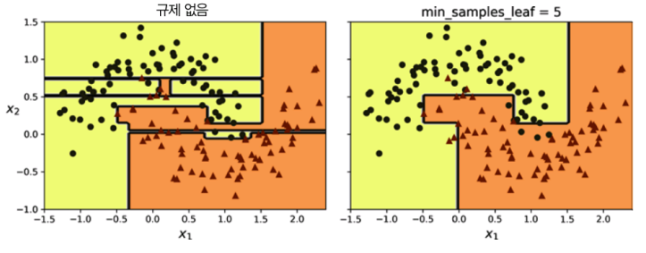

## 6.8 회귀

- 회귀 문제에도 결정 트리 사용 가능.

  <사이킷런의 DecisionTreeRegresor를 사용해 잡음이 섞인 2차 함수 형태의 데이터셋에서 max_depth=2 설정으로 회귀 트리 만들기>

  ```python
  import numpy as np
  from sklearn.tree import DecisionTreeRegressor  # 결정 트리 회귀 모델 import

  np.random.seed(42)  
  # 재현 가능성을 위해 시드 고정 (실험 반복 시 같은 난수 생성)

  X_quad = np.random.rand(200, 1) - 0.5           
  # 입력값 X를 -0.5 ~ +0.5 사이의 범위로 200개 생성 (1차원 벡터)

  y_quad = X_quad ** 2 + 0.025 * np.random.randn(200, 1) 
  # 타깃값 y는 X의 제곱 함수 + 약간의 노이즈 (정규분포 랜덤값)
  # 즉, y = x^2 형태의 곡선 관계를 가지는 데이터셋 생성
  ```

  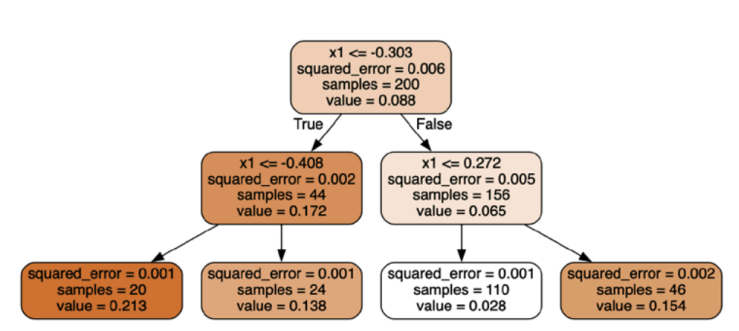

  ❗분류 트리와 비슷해보이지만 각 노드에서 클래스 대신 어떤 값을 예측한다는 차이가 있다.

  <두 개의 결정 트리 회귀 모델의 예측>

  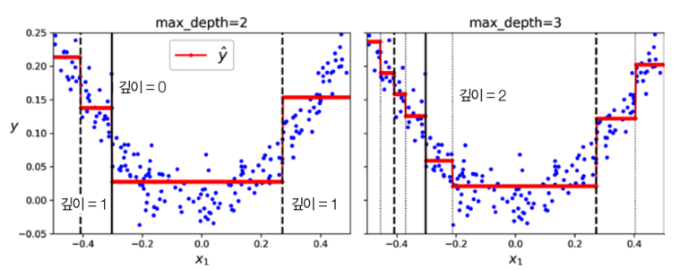

  <회귀를 위한 CART 비용 함수>

  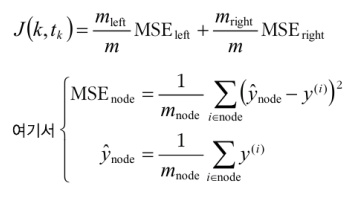

  ❗분류처럼 훈련 세트를 분순도를 최소화하는 방향으로 분할하는 대신 MSE를 최소화하는 방향으로 분할함. 그외에는 모두 같음.

## 6.9 축 방향에 대한 민감성

- 결정 트리는 비교적 이해와 해석이 쉽고 사용하기 편하며 용도가 다양하고 성능도 뛰어나는 등 많은 장점을 가지고 있음. 그러나 몇 가지 제한 사항도 있음.

- 그중 하나가 데이터의 방향에 민감하다는 것임. 이는 결정 트리가 계단 모양의 결정 경계를 만들기 때문에 발생함.

  <축 민감성>

  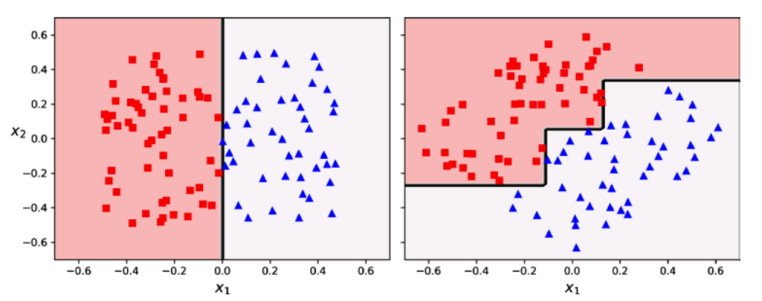

  ❗훈련 데이터를 45도 회전했을뿐이지만 결정 트리가 불필요하게 구불구불해짐.

- 이 문제의 해결 방안 중 하나는 **주성분 분석(PCA)**이다. 간략하게 말하자면 특성 간의 상관관계를 줄이는 방식으로 데이터를 회전하여 결정 트리를 더 쉽게 만들 수 있는 방법이라고 보면 된다.

## 6.10 결정 트리의 분산 문제

- 일반적으로 결정 트리의 주요 문제는 분산이 크다는 점이다. 즉, 하이퍼파라미터나 데이터를 조금만 변경해도 매우 다른 모델이 생성될 수 있다.

- 결정 트리의 예측을 평균하면 분산을 크게 줄일 수 있으며 이러한 결정 트리의 앙상블을 **랜덤 포레스트**라고 함.
