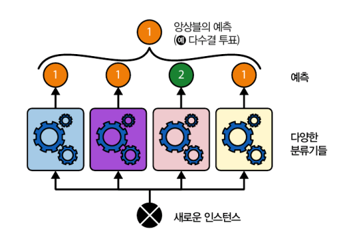
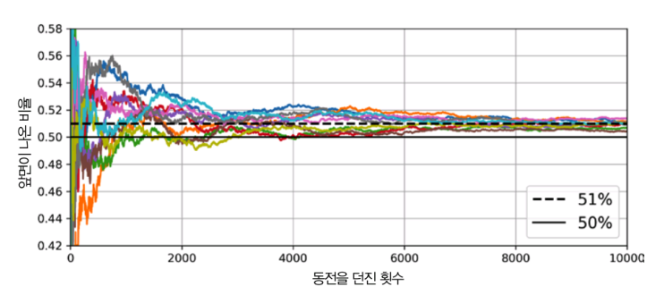
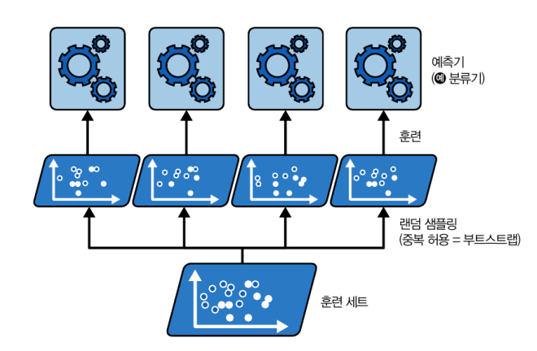
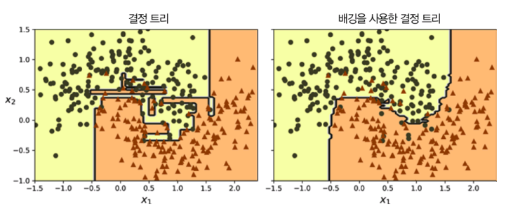

# 7 앙상블 학습과 랜덤 포레스트
- 복잡한 질문에 한 명의 전문가보다 여러 명이 모은 답이 더 나음. 이를 **대중의 지혜**라고 함
- 비슷하게 하나의 좋은 모델보다 일련의 예측기로부터 예측을 수집하면 더 좋은 겨롸를 얻을 수 있음. 이 일련의 예측기를 **앙상블**이라고 부르고 이를 이용한 학습을 **앙상블 학습**이라고 함.
- 결정 트리의 앙상블을 **랜덤 포레스트**라고 한다

## 7.1 투표 기반 분류기
- 좋은 분류기를 만드는 매우 간단한 방법은 여러 분류기를 훈련시키고 각 분류기의 예측을 집계하는 것임. 이를 **직접 투표 분류기**라고 함.
  
  <직접 투표 분류기의 예측>

  

  ❗예측력이 낮은 **약한 학습기**가 모여 정확도가 높은 **강한 학습기**가 될 수 있음.

- 이러한 것이 가능한 것은 시행 횟수가 많아질수록 실제 시행 결과가 이론적 확률값에 가까워지는 **큰 수의 법칙** 때문임.

  <큰 수의 법칙>

  

- 사이킷런에서 VotingClassfier 클래스를 이용하면 으름/예측기 쌍의 리스트만 제공하면 이를 일반 분류기처럼 쉽게 사용할 수 있음.
- 모든 분류기가 클래스의 확률을 예측할 수 있으면 개별 분류기의 예측을 평균 내에 확률이 가장 높은 클래스를 예측할 수 있으며 이를 **간접 투표**라고 함. 

## 7.2 배깅과 페이스팅

- 각기 다른 훈련 알고리즘을 사용하는 방법 외에 같은 알고리즘을 사용하나 훈련 세트의 서브셋을 랜덤으로 구성하여 분류기를 각기 다르게 학습시키는 방법도 가능함.
- 이때 훈련 세트에서 중복을 허용하면 **배깅**, 허용하지 않으면 **페이스팅**이라고 함.

  <배깅, 페이스팅>

  

- 모든 예측기가 훈련을 마치면 앙상블은 모든 예측기의 예측을 모아서 새로운 샘플에 대한 예측을 만듦.
- 이때 집계 함수는 분류일 때는 **통계적 최빈값**(직접 투표 분류기처럼 가장 많은 예측 결과)을, 회귀에서는 **평균**을 계산함.

### 7.2.1 사이킷런의 배깅과 페이스팅

- 사이킷런은 배깅과 페이스팅을 위해 간편한 API로 구성된 BaggingClassifier(회귀의 경우에는 BaggingRegressor)를 제공함.

  ```python
  from sklearn.ensemble import BaggingClassifier            # 배깅 앙상블 분류기 import
  from sklearn.tree import DecisionTreeClassifier           # 개별 모델로 사용할 결정 트리 분류기 import

  # 배깅 모델 정의: 500개의 결정 트리를 앙상블로 학습시킴
  bag_clf = BaggingClassifier(
      DecisionTreeClassifier(),    # 기본 분류기로 결정 트리 사용
      n_estimators=500,            # 트리 500개 생성
      max_samples=100,             # 각 트리는 훈련 세트에서 중복 허용하며 100개의 샘플만 뽑아 학습 (부트스트랩)
      n_jobs=-1,                   # 모든 CPU 코어 사용해서 병렬 처리
      random_state=42              # 결과 재현을 위한 시드 고정
  )

  bag_clf.fit(X_train, y_train)    # 배깅 모델 학습
  ```

  <단일 결정 트리 vs 500개의 트리로 만든 배깅 앙상블>

  

### 7.2.2 OOB 평가

- BaggingClassifier는 기본값으로 중복을 허용하여 훈련 세트의 크기만큼인 $m$개 샘플을 선택함.
- 따라서 각 예측기마다 평균 63% 정도만 샘플링되고 나머지 37%는 선택되지 않으며 이를 **OOB 샘플**이라고 부름.
- 별도의 검증 세트를 사용하지 않고 OOB 샘플을 사용해 평가가 가능함.
- 앙상블의 평가는 각 예측기의 OOB 평가를 평균내어 구함.