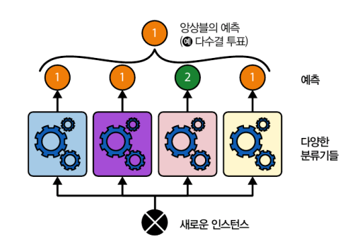
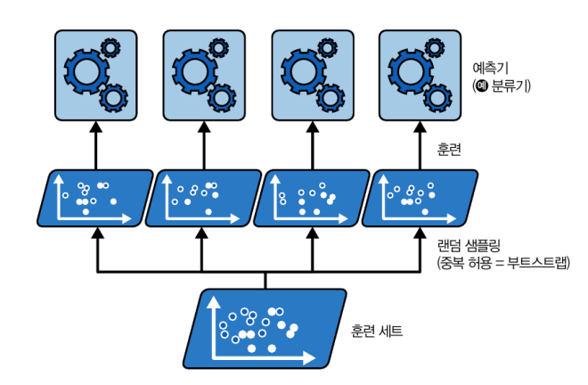
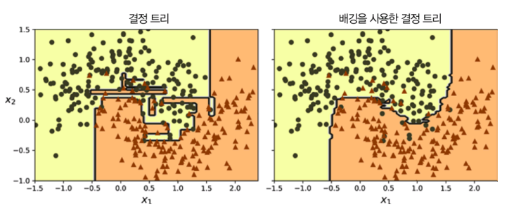
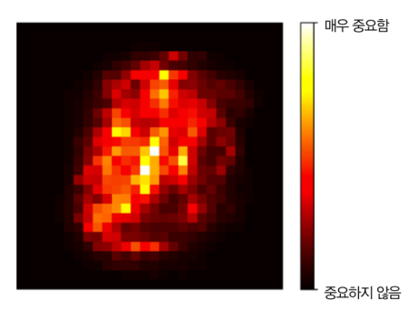
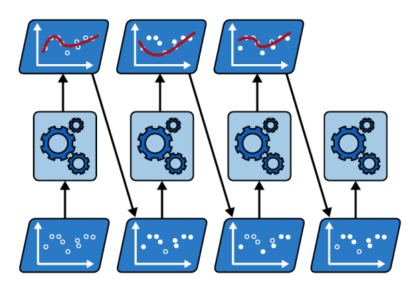
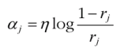
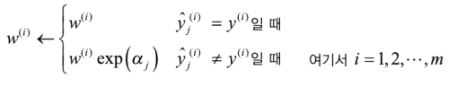

# 7 앙상블 학습과 랜덤 포레스트
- 복잡한 질문에 한 명의 전문가보다 여러 명이 모은 답이 더 나음. 이를 **대중의 지혜**라고 함
- 비슷하게 하나의 좋은 모델보다 일련의 예측기로부터 예측을 수집하면 더 좋은 겨롸를 얻을 수 있음. 이 일련의 예측기를 **앙상블**이라고 부르고 이를 이용한 학습을 **앙상블 학습**이라고 함.
- 결정 트리의 앙상블을 **랜덤 포레스트**라고 한다

## 7.1 투표 기반 분류기
- 좋은 분류기를 만드는 매우 간단한 방법은 여러 분류기를 훈련시키고 각 분류기의 예측을 집계하는 것임. 이를 **직접 투표 분류기**라고 함.
  
  <직접 투표 분류기의 예측>

  

  ❗예측력이 낮은 **약한 학습기**가 모여 정확도가 높은 **강한 학습기**가 될 수 있음.

- 이러한 것이 가능한 것은 시행 횟수가 많아질수록 실제 시행 결과가 이론적 확률값에 가까워지는 **큰 수의 법칙** 때문임.

  <큰 수의 법칙>

  

- 사이킷런에서 VotingClassfier 클래스를 이용하면 으름/예측기 쌍의 리스트만 제공하면 이를 일반 분류기처럼 쉽게 사용할 수 있음.
- 모든 분류기가 클래스의 확률을 예측할 수 있으면 개별 분류기의 예측을 평균 내에 확률이 가장 높은 클래스를 예측할 수 있으며 이를 **간접 투표**라고 함. 

## 7.2 배깅과 페이스팅

- 각기 다른 훈련 알고리즘을 사용하는 방법 외에 같은 알고리즘을 사용하나 훈련 세트의 서브셋을 랜덤으로 구성하여 분류기를 각기 다르게 학습시키는 방법도 가능함.
- 이때 훈련 세트에서 중복을 허용하면 **배깅**, 허용하지 않으면 **페이스팅**이라고 함.

  <배깅, 페이스팅>

  

- 모든 예측기가 훈련을 마치면 앙상블은 모든 예측기의 예측을 모아서 새로운 샘플에 대한 예측을 만듦.
- 이때 집계 함수는 분류일 때는 **통계적 최빈값**(직접 투표 분류기처럼 가장 많은 예측 결과)을, 회귀에서는 **평균**을 계산함.

### 7.2.1 사이킷런의 배깅과 페이스팅

- 사이킷런은 배깅과 페이스팅을 위해 간편한 API로 구성된 BaggingClassifier(회귀의 경우에는 BaggingRegressor)를 제공함.

  ```python
  from sklearn.ensemble import BaggingClassifier            # 배깅 앙상블 분류기 import
  from sklearn.tree import DecisionTreeClassifier           # 개별 모델로 사용할 결정 트리 분류기 import

  # 배깅 모델 정의: 500개의 결정 트리를 앙상블로 학습시킴
  bag_clf = BaggingClassifier(
      DecisionTreeClassifier(),    # 기본 분류기로 결정 트리 사용
      n_estimators=500,            # 트리 500개 생성
      max_samples=100,             # 각 트리는 훈련 세트에서 중복 허용하며 100개의 샘플만 뽑아 학습 (부트스트랩)
      n_jobs=-1,                   # 모든 CPU 코어 사용해서 병렬 처리
      random_state=42              # 결과 재현을 위한 시드 고정
  )

  bag_clf.fit(X_train, y_train)    # 배깅 모델 학습
  ```

  <단일 결정 트리 vs 500개의 트리로 만든 배깅 앙상블>

  

### 7.2.2 OOB 평가

- BaggingClassifier는 기본값으로 중복을 허용하여 훈련 세트의 크기만큼인 $m$개 샘플을 선택함.
- 따라서 각 예측기마다 평균 63% 정도만 샘플링되고 나머지 37%는 선택되지 않으며 이를 **OOB 샘플**이라고 부름.
- 별도의 검증 세트를 사용하지 않고 OOB 샘플을 사용해 평가가 가능함.
- 앙상블의 평가는 각 예측기의 OOB 평가를 평균내어 구함.

## 7.3 랜덤 패치와 랜덤 서브스페이스

- BaggingClassifier는 특성 샘플링도 지원함.
- max_features, bootstrap_features 두 매개변수로 조절됨.
- 이 기법은 훈련 속도를 크게 높일 수 있어 매우 고차원 데이터셋을 다룰 때 유용함.
- 훈련 특성과 샘플을 모두 샘플링하는 것을 **랜덤 패치 방식**이라고 하고 훈련 샘플을 모두 사용하고 특성을 샘플링하는 것을 **랜덤 서브스페이스 방식**이라고 함.

## 7.4 랜덤 포레스트

- 랜덤 포레스트는 배깅(또는 페이스팅)을 적용한 결정 트리의 앙상블이며 max_samples를 훈련 세트의 크기로 지정함.
- 결정 트리에 최적화된 RandomForestClassifier가 존재함.

  <500개의 결정 트리로 이루어진 랜덤 포레스트 분류기를 가능한 모든 CPU 코어에서 훈련시키기>
  ```python
  # 1. 모델 임포트
  # 사이킷런의 앙상블(ensemble) 패키지에서 RandomForestClassifier 클래스를 불러옵니다.
  from sklearn.ensemble import RandomForestClassifier

  # 2. 모델 인스턴스 생성 및 하이퍼파라미터 설정
  # RandomForestClassifier 모델의 인스턴스를 'rnd_clf' 변수에 할당하고, 주요 하이퍼파라미터를 정의합니다.
  rnd_clf = RandomForestClassifier(n_estimators=500,       # n_estimators: 앙상블에 사용할 결정 트리의 개수를 500개로 지정합니다.
   max_leaf_nodes=16,      # max_leaf_nodes: 각 트리가 가질 수 있는 최대 리프 노드(terminal node)의 수를 16개로 제한하여 모델의 복잡도를 제어하고 과적합을 방지합니다.
  n_jobs=-1,              # n_jobs: 모델 훈련 시 사용 가능한 모든 CPU 코어를 활용하여 처리 속도를 높입니다. (-1은 '모든 코어 사용'을 의미)
  random_state=42)        # random_state: 난수 생성 시드를 고정하여, 코드를 반복 실행해도 항상 동일한 모델이 생성되도록 보장합니(결과의 재현성 확보)

  # 3. 모델 학습
  # 생성된 'rnd_clf' 모델에 훈련 데이터(X_train)와 해당 정답 레이블(y_train)을 입력하여 모델을 학습(fit)시킵니다.
  rnd_clf.fit(X_train, y_train)

  # 4. 예측 수행
  # 학습이 완료된 모델을 사용하여 새로운 데이터인 테스트 데이터(X_test)에 대한 예측을 수행하고,
  # 그 예측 결과를 'y_pred_rf' 변수에 저장합니다.
  y_pred_rf = rnd_clf.predict(X_test)
  ```

### 7.4.1 엑스트라 트리

- 랜덤 포레스트에서 트리를 만들 때 각 노드는 랜덤으로 특성의 서브셋을 만들어 분할에 사용함.
- 트리를 더욱 랜덤하게 만들기 위해 최적의 임계값을 찾는 대신 후보 특성을 사용해 랜덤으로 분할 후 그중에서 최상의 분할을 선택하는 방법을 사용할 수 있으며 이는 DecisionTreeClassifier를 만들 때 splitter="random"으로 지정하면 사용 가능함/
- 이와 같이 극단적으로 랜덤한 트리의 랜덤 포레스트를 **익스트림 랜덤 트리 앙상블(엑스트라 트리)** 라고 하며 편향이 증가하는 대신 분산이 낮아짐.
- 작업 속도도 빠름(최적 임계값 찾기 자체가 시간 소요가 크기 때문)
- 사이킷런의 ExtraTreesClassifier를 사용함.

### 7.4.2 특성 중요도

- 랜덤 포레스트는 특성의 상대적 중요도를 측정하기 쉽다는 장점이 있음.
- 사이킷런은 어떤 특성을 사용한 노드가 평균적으로 불순도를 얼마나 감소시키는지 확인하여 특성의 중요도를 특정함.
- 사이킷런은 훈련 종료 후 각 특성마다 자동으로 이 점수를 계산하여 전체 중요도의 합이 1이 되도록 겨괏값을 정규화하여 features_importances_ 변수에 저장함.

  <랜덤 포레스트 분류기에서 얻은 MNIST 픽셀 중요도>

  

## 7.5 부스팅

- **부스팅(가설 부스팅)** 은 약한 학습기 여러 개를 연결하여 강한 학습기를 만드는 앙상블 방법임.
- 부스팅에는 여러 방법이 있으며 가장 유명한 것은 **AdaBoost**와 **그레이디언트 부스팅**임.

### 7.5.1 AdaBoost

- 이전 예측기를 보완하는 방법 중 하나는 이전에 과소적합하던 훈련 샘플의 가중치를 더 높이는 것임. 이것이 AdaBoost에서 사용하는 방식.
 
  <샘플의 가중치를 업데이트하면서 순차적으로 학습하는 AdaBoost>

  


- AdaBoost 알고리즘 자세히 살펴보기
  1. 각 샘플 가중치 $w^{(i)}$는 초기에 $1/m$로 초기화 됨.
  2. 첫 번째 예측기 학습 후 가중치가 적용된 오류율 $r_1$이 훈련 세트에 대해 계산됨.
  3. 예측기의 가중치 $\alpha_j$는 다음과 같이 계산됨.
     
     <예측기 가중치>

     

  4. 다음르로 AdaBoost 알고리즘이 샘플의 가중치를 업데이트함.
    
     <가중치 업데이트 규칙>

     

  5. 그 다음 모든 샘플의 가중치를 정규화함.
  6. 마지막으로 새 예측기가 업데이트된 가중치를 사용해 훈련되고 전체 과정이 반복됨.
  7. 이 알고리즘은 지정된 예측기 수에 도달하거나 완벽한 예측기가 만들어지면 중지됨.

- 사이킷런은 SAMME라는 AdaBoost의 다중 클래스 버전을 사용함.
  1. 클래스가 두 개뿐이라면 SAMME는 AdaBoost와 동일함.
  2. 예측기가 클래스의 확률을 추정할 수 있다면 사이킷런은 SAMME의 변형인 SAMME.R을 사용하며 이는 예측값 대신 클래스 확률을 기반으로 하고 성능도 더 좋음.

  ```python
  # 1. 모델 임포트
  # 사이킷런의 앙상블(ensemble) 패키지에서 AdaBoostClassifier 클래스를 불러옵니다.
  from sklearn.ensemble import AdaBoostClassifier

  # 2. 모델 인스턴스 생성 및 하이퍼파라미터 설정
  # AdaBoostClassifier 모델의 인스턴스를 'ada_clf' 변수에 할당합니다.
  # 에이다부스트는 약한 학습기(weak learner)를 순차적으로 개선하며 최종 모델을 만듭니다.
  ada_clf = AdaBoostClassifier(
      DecisionTreeClassifier(max_depth=1), # 기반 모델(base estimator)로 '결정 트리'를 사용하며, 'max_depth=1'로 설정하여 매우 단순한 모델(decision stump)을 지정합니다.
      n_estimators=30,                     # 앙상블을 구성할 약한 학습기의 최대 개수를 30개로 설정합니다. 즉, 30번의 순차적인 학습을 진행합니다.
      learning_rate=0.5,                   # 각 약한 학습기가 전체 모델의 예측에 기여하는 정도(가중치)를 조절하는 학습률입니다. 값이 낮을수록 이전 단계의 오류를 더 보수적으로 보완하며 학습합니다.
      random_state=42                      # 결과의 재현성을 위해 난수 생성 시드를 42로 고정합니다.
  )

  # 3. 모델 학습
  # 설정된 하이퍼파라미터에 따라, 훈련 데이터(X_train)와 정답 레이블(y_train)을 사용하여 에이다부스트 모델을 학습(fit)시킵니다.
  ada_clf.fit(X_train, y_train)
  ```
  