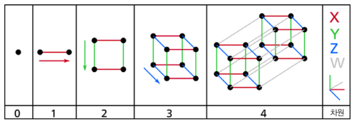
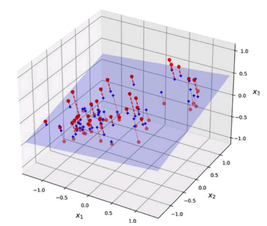
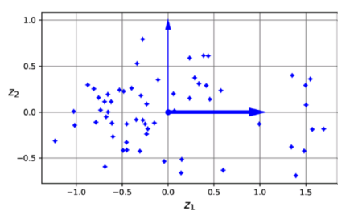
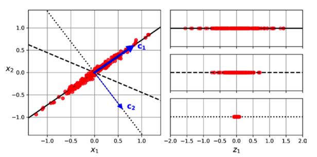
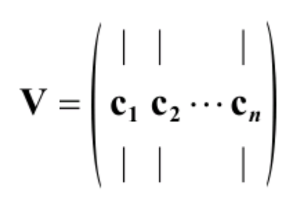
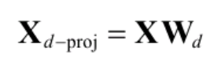
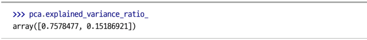
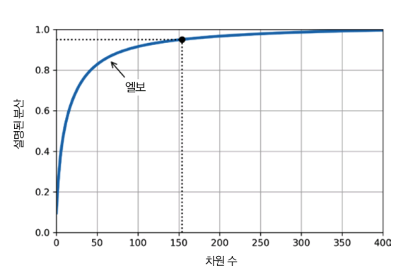
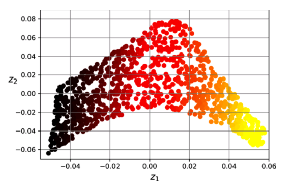

# 차원 축소

- 머신러닝 문제의 데이터들은 매우 많은 특성을 지님. 때문에 훈련이 느려지고 좋은 솔루션을 찾기 어려워짐. 이러한 현상을 **차원의 자주**라고 함.
- **차원 축소**를 이용하면 이러한 문제를 해결할 수 있음.

## 8.1 차원의 저주

- 3차원에 살아가는 우리는 고차원을 상상하기 힘듦.

  <점, 선, 정사각형, 정육면체, 테서랙트>

  

- 저차원에서는 점들이 서로 가깝게 분포하지만, 차원이 커질수록 점들 간 거리가 급격히 멀어짐.

- 예: 1D에서 경계 근처에 있을 확률은 낮지만, 10,000D에서는 거의 모든 점이 경계에 가까움.

- 차원이 높아질수록 훈련 데이터가 서로 멀리 떨어져 희박해지고, 새로운 데이터가 기존 데이터 근처에 있을 확률이 낮아짐.

- 이런 상황에서는 **외삽(extrapolation)** 이 많아져 예측이 불안정해지고, 과대적합 위험이 커짐.

- 해결책: 훈련 데이터의 밀도를 충분히 확보할 때까지 훈련 세트를 크게 늘려야 함. 하지만 차원이 커질수록 필요한 데이터 수는 기하급수적으로 증가함.

## 8.2 차원 축소를 위한 접근법

### 8.2.1 투영

- 대부분 실전에선 많은 특성이 거의 변화가 없는 반면, 다른 특성들은 서로 강하게 연관되어 있음.
- 결과적으로 모든 훈련 샘플이 고차원 공간 안에 저차원 **부분 공간** 근처에 놓여있음.

  <2차원에 가깝게 배치된 3차원 데이터셋>

  

  ❗이러한 데이터를 2차원 부분 공간에 수직으로 투영하면 3D를 2D로 축소할 수 있음.

  <투영하여 만들어진 새로운 2D 데이터셋>

  

- **스위스 롤** 데이터셋처럼 부분 공간이 뒤틀리거나 휘어있는 경우엔 투영을 사용하면 안됨.

### 8.2.2 매니폴드 학습

- **매니폴드**: 고차원 공간에 박혀 있는 저차원 곡면. 국소적으로는 𝑑차 초평면처럼 보임. (예: 스위스롤 = 3D 속 2D 매니폴드)

- 매니폴드 가정/가설: 현실의 고차원 데이터는 실제로 **낮은 차원 매니폴드 위(혹은 근처)** 에 놓여 있다. 그래서 차원 축소 알고리즘은 이 매니폴드를 모델링/평탄화하려고 듦.

- MNIST 예시: 784차 이미지 공간이라도 손글씨 숫자는 **연속적인 제약(획, 굵기, 위치 등)** 을 받기 때문에 랜덤 이미지보다 훨씬 낮은 자유도를 갖는 저차원 매니폴드에 모임 → 차원 축소로 압축/가시화가 유리.

- 분류에의 효과: 매니폴드를 잘 펼치면(언롤링) 결정 경계가 단순해질 수 있음. 스위스롤처럼 3D에선 꼬여 있던 클래스가 2D로 펴면 깨끗이 분리됨.

- 하지만 항상 이득이 아님. 원공간에서 **단순한 경계(예: $x_1 = 5$ 같은 평면 같은 평면)** 가 매니폴드 위로 사상되면 복잡한 여러 곡선으로 찢어질 수 있다 → 오히려 학습이 어려워짐.

- 결론: 매니폴드 학습은 “데이터가 진짜 저차원 구조를 따른다”는 가정이 맞을 때만 이득. 경계가 더 단순해지는지 확인하고 쓰되, 맹신하지 말고 **검증(시각화/교차검증)** 으로 확인.

## 8.3 주성분 분석

- **주성분 분석**은 가장 인기있는 차원 축소 알고리즘 중 하나로 데이터에 가장 가까운 초평면을 정의한 후 데이터를 이 평면에 투영시킴.

### 8.3.1 분산 보존

- 가장 먼저 올바른 초평면을 선택해야 함.

  <투영할 부분 공간 선택하기>

  

  ❗분산이 최대로 보존되는 실선 축($c_1$)이 적절한 초평면임.
  
  ❗'원본 데이터셋과 투영된 것 사이의 평균 제곱 거리를 최소화하는 축'이라고 설명할 수도 있음.

### 8.3.2 주성분

- PCA는 데이터의 분산이 가장 큰 축부터 차례로 찾아내는 기법임.

- 첫 번째 주성분(PC1)은 분산이 최대인 축, 두 번째 주성분(PC2)은 남은 분산이 최대인 축임.

- 고차원 데이터에서는 세 번째, 네 번째 등 순차적으로 분산이 큰 축을 찾아냄.

- 각 주성분은 단위 벡터이며 방향은 일정하지 않고, 축의 분산이 비슷하면 주성분이 서로 바뀔 수 있음.

- 주성분을 찾기 위해 SVD(특잇값 분해)를 사용하며, 데이터 행렬 X를 UΣVᵀ로 분해

- 찾고자하는 모든 주성분의 단위 벡터들은 V에 들어있음.

  <주성분 행렬>

  

  <넘파이의 svd() 함수를 사용해 3D 훈련 세트의 모든 주성분을 구한 후 처음 두 개의 PC를 정의하는 두 개의 벡터 추출하기>

  ```python
  import numpy as np  # NumPy 라이브러리를 불러옴 (수치 계산용)

  X = [...]  # 작은 3D 데이터셋 생성 (예: 좌표 데이터)

  # 각 특성(컬럼)의 평균을 빼서 데이터를 중앙에 맞춤(평균=0)
  X_centered = X - X.mean(axis=0)

  # 특잇값 분해(SVD) 수행: X_centered = U * s * Vt
  U, s, Vt = np.linalg.svd(X_centered)

  # 첫 번째 주성분(PC1) 벡터
  c1 = Vt[0]

  # 두 번째 주성분(PC2) 벡터
  c2 = Vt[1]
  ```

### 8.3.3 $d$ 차원으로 투영하기

- 처음 $d$개의 주성분으로 정의한 초평면에 투영하여 데이터셋의 차원을 $d$차원으로 축소시킬 수 있음.

  <훈련 세트를 $d$차원으로 투영하기>

  

### 8.3.4 사이킷런 사용하기

  <PCA 모델을 사용해 데이터셋의 차원을 2로 줄이기>

  ```python
  from sklearn.decomposition import PCA  # PCA(주성분 분석) 모듈 불러오기

  # 주성분 개수를 2개로 지정하여 PCA 객체 생성 (2차원으로 축소)
  pca = PCA(n_components=2)

  # 데이터 X에 PCA 적용 후, 2차원으로 변환된 데이터 반환
  X2D = pca.fit_transform(X)
  ```

### 8.3.5 설명된 분산의 비율

- explained_variance_ratio_ 변수에 저장된 주성분의 **설명된 분산의 비율**은 유용한 정보임.
  <3D 데이터셋의 처음 두 주성분에 대한 설명된 분산의 비율>

 

 ❗이는 데이터셋 분산의 76%가 첫 번째 PC를 따라 놓여 있고 15%가 두 번째 PC를 따라 놓여 있음을 알려줌.

### 8.3.6 적절한 차원 수 선택

- 축소할 차원 수를 임의로 정하기 보단 충분한 분산(예: 95%)이 될 때까지 더해야 할 차원 수를 선택하는 것이 간단함.
- 또 다른 방법으로 설명된 분산을 차원 수에 대한 함수로 그리는 것이 있음.

  <차원 수에 대한 함수로 나타낸 설명된 분산>

  

- 지도 학습 작업의 전처리 단계로 차원 축소를 사용하는 경우, 다른 하이퍼파라미터와 마찬가지로 차원 수를 튜닝할 수 있음.
  
### 8.3.7 압축을 위한 PCA

- 차원 축소를 하면 훈련 세트는 훨씬 적은 공간을 차지하게 됨. (특성 수 자체가 줄어드니)
- 압축된 데이터셋에 PCA 투영의 변환을 반대로 적용하여 원래 차원으로 되돌릴 수도 있음. 단, 이미 일정량의 정보(유실된 분산)를 잃어버렸기 때문에 원본 데이터셋을 얻을 순 없음. 그러나 매우 비슷함.
- 원본 데이터와 재구성된 데이터 사이의 평균 제곱 거리를 **재구성 오차**라고 함.

### 8.3.8 랜덤 PCA

- svd_solver 매개변수를 "randomized"로 지정하면 사이킷런은 랜덤 PCA라 부르는 확률적 알고리즘을 사용해 처음 $d$개의 주성분에 대한 근삿값을 빠르게 찾음.

### 8.3.9 점진적 PCA

- PCA 구현의 문제는 SVD 알고리즘을 실행하기 위해 전체 훈련 세트를 메모리에 올려야 한다는 것임.
- **점진적 PCA** 알고리즘은 훈련 세트를 미니배치로 나눈 뒤 IPCA 알고리즘에 한 번에 하나씩 주입함으로서 이 문제를 해결함.
- 사이킷런에서는 미니배치를 IncrementalPCA 파이썬 클래스에 주입하여 차원을 축소함.
- 넘파이의 memmap 클래스를 사용할 수도 있음.

## 8.4 랜덤 투영

- 매우 고차원 데이터셋의 경우 PCA가 너무 느려질 수 있어 이럴 땐 랜덤 투영을 사용하는 것을 고려해야 함.
- 랜덤 투영 알고리즘은 랜덤한 선형 투영을 사용하여 데이터를 저차원 공간에 투영함. 놀랍게도 이는 수학적으로 실제로 거리를 상당히 잘 보존할 가능성이 매우 높다는 것이 밝혀짐.
- 이때 정보의 손실을 고려한 최적의 차원 수를 찾는 방정식이 존재함. 방정식은 'd >= 4 * log(m) / ( (1/2) * ε^2 - (1/3) * ε^3 )'임. (d=차원 수, m=샘플 수, ε=변경 시 초과되지 않길 원하는 제곱 거리)
- 이 방정식은 johnson_lindenstrauss_min_dim() 함수에 구현되어 있음
- 사이킷런은 GaussianRandomProjection 클래스를 제공함.
- 사이킷런은 또한 SparseRandomProjection이라는 두 번째 랜덤 투영 변환기도 제공함. GaussianRandomProjection과의 가장 큰 차이점은 랜덤 행렬이 희소하다는 것임. 따라서 메모리 사용량이 매우 적으며 훨씬 빠름. 또한 입력이 희소할 경우 이 변환은 희소성을 유지하며 GaussianRandomProjection의 경우와 동일한 거리 보존 속성과 차원 축소 품질을 지님. 때문에 특히 규모가 크거나 희박한 데이터셋에 더 적절함.

## 8.5 지역 선형 임베딩

- **지역 선형 임베딩(LLE)** 은 **비선형 차원 축소** 기술로 PCA, 랜덤 투영과 달리 투영에 의존하지 않는 매니폴드 학습임.
- LLE 알고리즘
  1. 각 훈련 샘플이 최근접 이웃에 얼마나 선형적으로 연관되어 있는지를 측정함.
  2. 국부적인 관계가 가장 잘 보존되는 훈련 세트의 저차원 표현을 찾음.

  <사이킷런의 LocallyLinearEmbedding을 사용해 스위스 롤 펼치기>

  ```python
  # 사이킷런의 'datasets'에서 꽈배기 모양의 3D 샘플 데이터인 '스위스 롤'을 만드는 함수를 불러온다.
  # 이런 비선형 차원 축소 알고리즘을 테스트하기 딱 좋은 장난감 데이터다.
  from sklearn.datasets import make_swiss_roll

  # 사이킷런의 'manifold' 라이브러리에서 LLE(지역 선형 임베딩) 알고리즘을 불러온다.
  from sklearn.manifold import LocallyLinearEmbedding

  # 1000개의 점으로 이루어진 3D 스위스 롤 데이터를 생성한다.
  # X_swiss: 각 점의 3차원(x, y, z) 좌표. 이게 우리가 펼쳐야 할 대상이다.
  # t: 각 점의 펼쳤을 때의 위치(색상 구분용).
  # noise: 데이터에 약간의 노이즈를 추가해서 더 현실적으로 만든다.
  X_swiss, t = make_swiss_roll(n_samples=1000, noise=0.2, random_state=42)

  # LLE 모델을 생성하고 설정값을 정한다.
  lle = LocallyLinearEmbedding(n_components=2,       # n_components=2: 3차원 데이터를 2차원으로 펼치라는(축소하라는) 명령.
                               n_neighbors=10,       # n_neighbors=10: LLE의 핵심. 각 점이 자신의 정체성을 파악하기 위해 주변의 가장 가까운 '이웃' 10개를 참고하라는 뜻.
                               random_state=42)

  # 위에서 만든 LLE 모델에 3D 스위스 롤 데이터를 넣고, 2차원으로 펼치는 작업을 실행한다.
  # fit_transform: 데이터의 구조를 학습(fit)하고, 그 결과를 바탕으로 차원 축소를 실행(transform)하라는 명령.
  X_unrolled = lle.fit_transform(X_swiss)
  ```
  

  ❗스위스 롤이 완전히 펼쳐졌고 지역적으로는 샘플 간 거리가 잘 보존되어 있음. 그러나 크게 보면 샘플 간 거리가 잘 유지되어 있지 않음. (펼쳐진 스위스 롤은 직사각형이여야 함.)

- LLE 알고리즘 순서
  1. 최근접 이웃 찾기: 각 샘플 x^(i)에 대해 k개의 가장 가까운 이웃들을 찾음. (보통 k=10)
  2. 가중치 계산: 각 샘플 x^(i)를 그 이웃들의 선형결합으로 재구성하는 가중치 w_ij를 구함.
     -  x^(i) ≈ Σ w_ij x^(j) (제곱거리 최소화)
     - 가장 가까운 k개 이웃이 아닌 경우 w_ij = 0
  3. 저차원 임베딩: 구한 가중치 w_ij를 그대로 유지하면서, 각 샘플을 저차원 공간으로 매핑.

## 8.6 다른 차원 축소 기법

- 다차원 스케일링 (MDS)
  - 샘플 간의 거리를 보존하면서 차원을 축소
  - 원본 투영은 고차원, 최종 투영은 저차원에서 거리를 잘 유지

- Isomap
  - 각 샘플을 가장 가까운 이웃과 연결하여 그래프를 만듦
  - **지오데식 거리**를 이용해 차원 축소
  - 그래프에서 두 노드 사이의 최단 경로를 이용한 거리 계산

- t-SNE
  - 비슷한 샘플은 가까이, 비슷하지 않은 샘플은 멀리 떨어뜨려 차원 축소
  - 주로 시각화 목적으로 사용되며 특히 고차원 공간에서 복잡한 구조 시각화에 효과적
  - MNIST 이미지의 2D 맵 그리기에 자주 활용됨

- 선형 판별 분석 (LDA)
  - 선형 분류 알고리즘으로, 클래스 사이를 가장 잘 구분하는 축을 학습
  - 투영된 데이터가 클래스별로 잘 분리되도록 차원 축소