# 9장 비지도 학습

- 대부분의 머신러닝 시스템에서 훈련 데이터에는 타깃이 없음
- 사람이 레이블을 달기엔 시간과 비용이 많이 들어서 대부분 레이블이 없는 데이터임
- 8장에서 다룬 차원 축소가 가장 널리 사용되는 비지도 학습 방법임

주요 비지도 학습 작업:
- **군집**: 비슷한 샘플을 클러스터로 묶음
- **이상치 탐지**: 정상 샘플을 학습해서 비정상 샘플 탐지
- **밀도 추정**: 데이터셋의 확률밀도함수(PDF) 추정

## 9.1 군집

**군집**은 비슷한 샘플을 구별하여 클러스터(비슷한 샘플의 그룹)로 할당하는 작업임.

<분류 vs 군집>

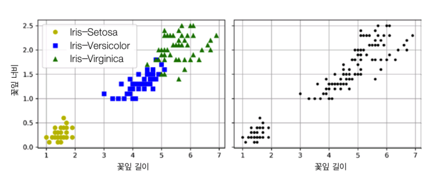

### 군집의 활용
- **고객 분류**: 구매 데이터로 고객 세분화 → 타깃 마케팅
- **데이터 분석**: 클러스터별 분석으로 패턴 발견
- **차원 축소**: 클러스터 친화성을 새로운 특성으로 사용
- **특성 공학**: 클러스터와의 거리를 새로운 특성으로 추가
- **이상치 탐지**: 모든 클러스터와 거리가 먼 샘플을 이상치로 판단
- **준지도 학습**: 같은 클러스터에 레이블 전파
- **검색 엔진**: 유사한 이미지나 문서 빠르게 찾기
- **이미지 분할**: 픽셀을 색상별로 클러스터링

### 9.1.1 k-평균

k-평균은 각 샘플을 k개 클러스터 중 하나에 할당하는 알고리즘임.

<샘플 덩어리 다섯 개로 이루어진 레이블 없는 데이터셋>

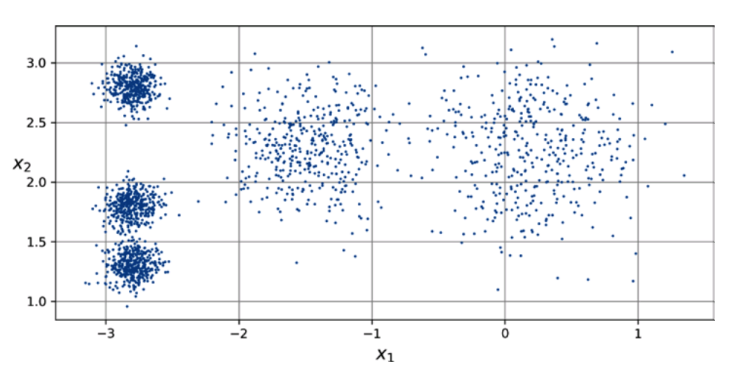

**k-평균 알고리즘**:
1. k개 센트로이드를 임의로 배치
2. 각 샘플을 가장 가까운 센트로이드에 할당
3. 할당된 샘플들의 평균으로 센트로이드 업데이트
4. 수렴할 때까지 2-3단계 반복

<k-평균 알고리즘>

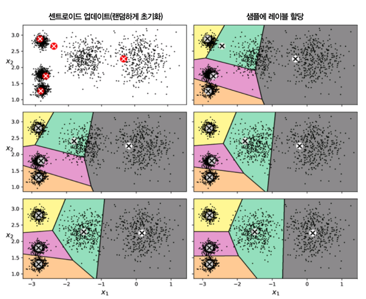

- **하드 군집**: 각 샘플이 하나의 클러스터에만 속함
- **소프트 군집**: 각 샘플이 여러 클러스터에 속할 확률을 가짐

**알고리즘의 한계**:
- 수렴은 보장되지만 지역 최적해에 빠질 수 있음
- 초기 센트로이드 위치에 따라 결과가 달라짐

<운 나쁜 센트로이드 초기화 때문에 만들어진 최적이 아닌 솔루션>

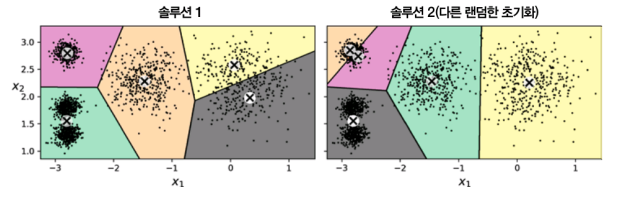

**센트로이드 초기화**:
k-평균++ 초기화를 사용하면 더 나은 결과를 얻을 수 있음. 첫 센트로이드는 랜덤하게, 이후는 기존 센트로이드와 거리가 먼 점을 확률적으로 선택.

**최적 클러스터 개수 찾기**:

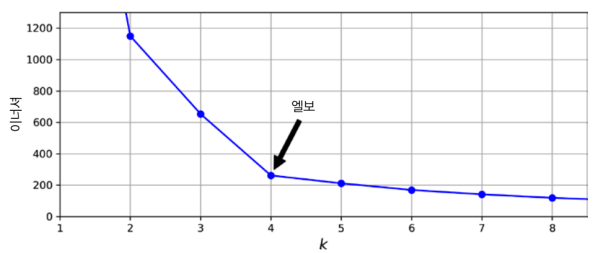

**이너셔(관성)**: 샘플과 가장 가까운 센트로이드 사이의 거리 제곱의 합
- k가 증가하면 이너셔는 감소하지만, 무작정 큰 k를 선택하면 과적합

**엘보우 방법**: 이너셔 감소율이 급격히 떨어지는 "엘보우" 지점을 찾아 최적 k 결정

**실루엣 점수**: 클러스터 내 응집도와 클러스터 간 분리도를 측정하는 지표

<실루엣 점수를 사용해 클러스터 개수 k를 선택하기>

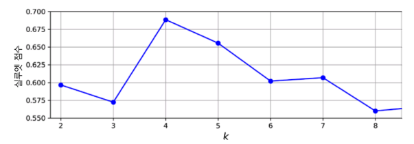

### 9.1.2 k-평균의 한계

k-평균은 다음과 같은 한계가 있음:

<k-평균이 세 개의 타원형 클러스터를 적절히 구분하지 못합니다>

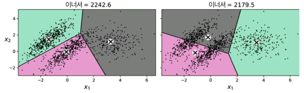

- 구형 클러스터만 잘 찾음 (타원형이나 복잡한 모양에 취약)
- 클러스터 크기가 비슷해야 함
- 클러스터 밀도가 비슷해야 함
- 이상치에 민감함

### 9.1.3 군집을 사용한 이미지 분할

**이미지 분할**: 이미지를 여러 세그먼트로 나누는 작업
- **색상 분할**: 비슷한 색상의 픽셀을 같은 세그먼트로 묶음
- **시멘틱 분할**: 같은 객체에 속한 픽셀을 같은 세그먼트로 묶음
- **인스턴스 분할**: 개별 객체를 구분하여 분할

### 9.1.4 군집을 사용한 준지도 학습

레이블이 부족할 때 군집을 이용한 **레이블 전파**가 유용함:
1. 전체 데이터를 군집화
2. 각 클러스터에서 가장 가까운 레이블된 샘플의 레이블로 전파
3. 전파된 레이블로 분류기 훈련

### 9.1.5 DBSCAN

**DBSCAN**(Density-Based Spatial Clustering)은 밀도 기반 군집 알고리즘임.

<두 가지 이웃 반경을 사용한 DBSCAN 군집>

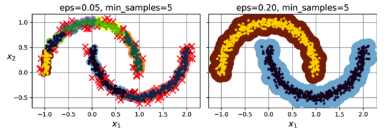

**주요 개념**:
- **ε(엡실론)**: 이웃을 정의하는 거리
- **최소 샘플 수**: 핵심 포인트가 되기 위한 최소 이웃 수
- **핵심 포인트**: ε 반경 내에 최소 샘플 수 이상의 이웃을 가진 포인트
- **경계 포인트**: 핵심 포인트의 이웃이지만 자신은 핵심 포인트가 아닌 포인트
- **이상치**: 핵심 포인트도 경계 포인트도 아닌 포인트

**DBSCAN의 장점**:
- 클러스터 개수를 미리 정할 필요 없음
- 임의 모양의 클러스터 탐지 가능
- 이상치 자동 탐지
- 클러스터 크기와 밀도가 달라도 잘 작동

**단점**:
- 밀도가 크게 다른 클러스터는 구분 어려움
- 고차원에서 성능 저하

### 9.1.6 다른 군집 알고리즘

**병합 군집**: 개별 샘플부터 시작해서 점진적으로 클러스터를 합침 (상향식)

**BIRCH**: 대규모 데이터셋을 위한 계층적 군집 알고리즘

**평균 이동**: 각 샘플 주변 원 안의 샘플들 평균으로 이동을 반복

**스펙트럴 군집**: 샘플 간 유사도 행렬의 고유벡터를 이용한 군집

## 9.2 가우스 혼합

**가우스 혼합 모델(GMM)** 은 여러 가우스 분포의 혼합으로 데이터를 모델링하는 생성 모델임.

<훈련된 가우스 혼합 모델의 클러스터 평균, 결정 경계, 밀도 등고선>

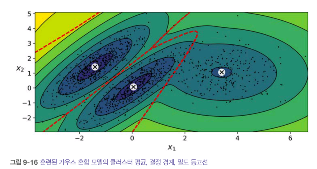

**GMM vs k-평균**:
- **k-평균**: 하드 군집, 구형 클러스터만 가능
- **GMM**: 소프트 군집, 타원형 클러스터 가능, 각 클러스터의 크기/모양/방향 학습

```python
from sklearn.mixture import GaussianMixture

gm = GaussianMixture(n_components=3, random_state=42)
gm.fit(X)
```

**공분산 제약 조건**:

<타이드(tied) 클러스터(왼쪽)와 원형 클러스터(오른쪽)를 사용한 가우스 혼합>

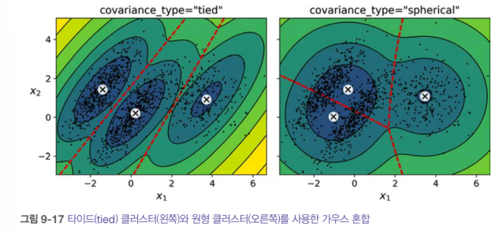

- **"spherical"**: 모든 클러스터가 원형 (분산이 모든 방향에서 같음)
- **"diag"**: 타원형이지만 축이 좌표축과 평행
- **"tied"**: 모든 클러스터가 같은 모양
- **"full"**(기본값): 각 클러스터가 임의의 타원 모양

### 9.2.1 가우스 혼합을 사용한 이상치 탐지

밀도가 낮은 지역의 샘플을 이상치로 탐지:

<가우스 혼합 모델을 사용한 이상치 탐지>

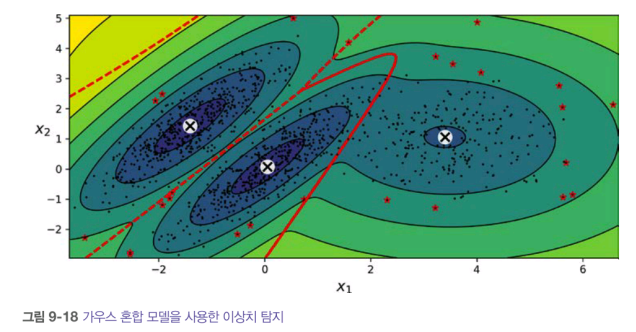

```python
densities = gm.score_samples(X)
density_threshold = np.percentile(densities, 4)  # 하위 4%를 이상치로 간주
anomalies = X[densities < density_threshold]
```

### 9.2.2 클러스터 개수 선택

가우스 혼합에서는 **정보 기준**을 사용해 최적 클러스터 개수 선택:

<모델의 파라미터 함수(왼쪽 위)와 여기에서 유도된 함수: PDF(왼쪽 아래), 가능도 함수(오른쪽 위), 로그 가능도 함수(오른쪽 아래)>

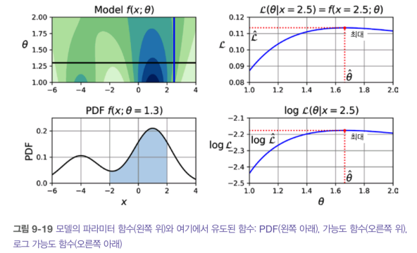

**AIC**(Akaike Information Criterion): AIC = -2log(L̂) + 2p
**BIC**(Bayesian Information Criterion): BIC = -2log(L̂) + p×log(m)

- L̂: 최대 가능도
- p: 모델 파라미터 수
- m: 샘플 수

<여러 가지 클러스터 개수 k에 대한 AIC와 BIC>

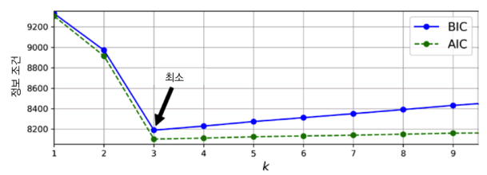

BIC와 AIC가 최소인 지점이 최적 클러스터 개수임.

### 9.2.3 베이즈 가우스 혼합 모델

**BayesianGaussianMixture**는 불필요한 클러스터의 가중치를 자동으로 0으로 만들어 최적 개수를 자동 선택:

<타원형이 아닌 클러스터에 가우스 혼합 모델 훈련하기>

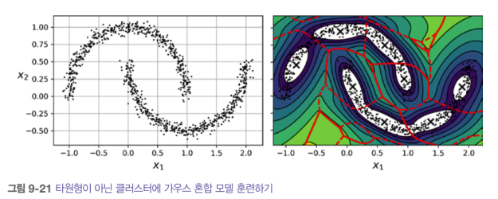

```python
from sklearn.mixture import BayesianGaussianMixture

bgm = BayesianGaussianMixture(n_components=10, random_state=42)
bgm.fit(X)
print(bgm.weights_)  # 필요한 클러스터만 0이 아닌 가중치를 가짐
```

### 9.2.4 이상치 탐지와 특이치 탐지를 위한 알고리즘

**EllipticEnvelope**(Fast-MCD): 다변량 가우스 분포 가정 하에 이상치 탐지

**IsolationForest**: 고차원에서 효율적인 이상치 탐지, 이상치는 격리하기 쉽다는 아이디어

**LocalOutlierFactor**(LOF): 지역 밀도 기반 이상치 탐지

**OneClassSVM**: 정상 데이터의 경계를 학습하여 특이치 탐지